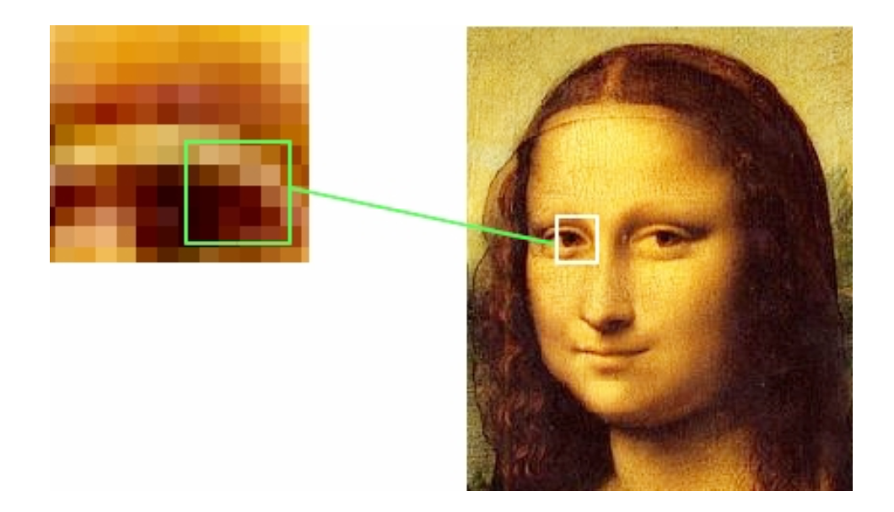
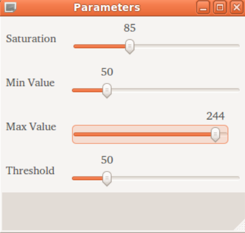

# 10.8 OpenCV: библиотека компьютерного зрения с открытым исходным кодом

OpenCV был разработан Intel в 1999 году для тестирования приложений, интенсивно использующих процессор, а код был выпущен для публики в 2000 году. В 2008 году Willow Garage занялась первичной разработкой. [OpenCV](http://www.opencv.org/) не так прост в использовании, как некоторые графические пакеты на основе графического интерфейса, такие как [RoboRealm](http://www.roborealm.com/) для Windows. Однако функции, доступные в OpenCV, представляют собой множество современных алгоритмов визуализации, а также методы машинного обучения, такие как машины опорных векторов, искусственные нейронные сети и случайные деревья.

OpenCV может работать как отдельная библиотека в Linux, Windows, MacOS X и Android. Для новичков в OpenCV, обратите внимание, что мы затронем лишь небольшую часть возможностей OpenCV. Для полного знакомства с библиотекой и всеми ее функциями, пожалуйста, обратитесь к разделу [«Изучение OpenCV»](http://www.amazon.com/Learning-OpenCV-Computer-Vision-Library/dp/0596516134) Гари Брадски и Адриана Келера. Вы также можете обратиться к полному [онлайн-руководству](http://docs.opencv.org/), включая несколько вводных руководств.

#### _10.8.1 Распознавание лиц_

OpenCV позволяет относительно легко определять лица в изображении или видеопотоке. И так как это популярный запрос для тех, кто интересуется роботизированным зрением, это хорошее место для начала.

Детектор лица OpenCV использует каскадный классификатор с функциями типа [Хаара](http://docs.opencv.org/modules/objdetect/doc/cascade_classification.html). Вы можете узнать больше о каскадных классификаторах и функциях Haar по предоставленной ссылке. Пока все, что нам нужно понять, - это то, что каскадный классификатор OpenCV может быть инициализирован различными XML-файлами, которые определяют объект, который мы хотим обнаружить. Мы будем использовать два из этих файлов, чтобы обнаружить лицо, если смотреть прямо спереди. Другой файл позволит нам обнаружить лицо, если смотреть со стороны \(вид профиля\). Эти файлы были созданы с помощью алгоритмов машинного обучения на сотнях или даже тысячах изображений, которые либо содержат лицо, либо не содержат его. Затем алгоритм обучения может извлекать признаки, которые характеризуют лица, и результаты сохраняются в формате XML. \(Дополнительные каскадные файлы были обучены для обнаружения глаз и даже целых людей.\)

Некоторые из этих файлов XML были скопированы из дерева исходных текстов OpenCV в каталог rbx1\_vision / data / haar\_detectors, и мы будем использовать их в наших скриптах ниже.

Наш узел обнаружения лиц ROS находится в файле face\_detector.py в каталоге rbx1\_vision / src / rbx1\_vision. Прежде чем мы посмотрим на код, давайте попробуем.

Чтобы запустить детектор, сначала запустите соответствующий видеодрайвер:

Для Microsoft Kinect:

```text
$ roslaunch freenect_launch freenect-registered-xyzrgb.launch
```

Для камер Asus Xtion, Xtion Pro или Primesense 1.08 / 1.09:

```text
$ roslaunch openni2_launch openni2.launch depth_registration:=true
```

Или для веб-камеры:

```text
$ roslaunch rbx1_vision uvc_cam.launch device:=/dev/video0
```

\(При необходимости измените видеоустройство.\)

Теперь запустите узел детектора лица:

```text
$ roslaunch rbx1_vision face_detector.launch
```

Если вы поместите свое лицо в рамку камеры, вы увидите зеленую рамку вокруг вашего лица, когда каскадный детектор обнаружит ее. Когда детектор потеряет ваше лицо, окно исчезнет, ​​и вы увидите сообщение "LOST FACE!" на экране. Попробуйте повернуть лицо из стороны в сторону, вверх и вниз. Также попробуйте двигать рукой перед лицом. Число «Hit Hit», также отображаемое на экране, представляет собой количество кадров, в которых было обнаружено ваше лицо, деленное на общее количество кадров на данный момент.

Как вы можете видеть, детектор довольно хорош, но у него есть ограничения - детектор теряет ваше лицо, когда вы поворачиваете голову слишком далеко от фронтального или бокового обзора. Тем не менее, поскольку люди \(и роботы\), как правило, взаимодействуют друг с другом, детектор может выполнять работу во многих ситуациях.

Давайте теперь посмотрим код.

Ссылка на источник: [face\_detector.py](https://github.com/pirobot/rbx1/blob/indigo-devel/rbx1_vision/src/rbx1_vision/face_detector.py)

```text
#!/usr/bin/env python
import rospy
import cv2
import cv2.cv as cv
from rbx1_vision.ros2opencv2 import ROS2OpenCV2
class FaceDetector(ROS2OpenCV2):
def __init__(self, node_name):
super(FaceDetector, self).__init__(node_name)
# Get the paths to the cascade XML files for the Haar detectors.
# These are set in the launch file.
cascade_1 = rospy.get_param("~cascade_1", "")
cascade_2 = rospy.get_param("~cascade_2", "")
cascade_3 = rospy.get_param("~cascade_3", "")
# Initialize the Haar detectors using the cascade files
self.cascade_1 = cv2.CascadeClassifier(cascade_1)
self.cascade_2 = cv2.CascadeClassifier(cascade_2)
self.cascade_3 = cv2.CascadeClassifier(cascade_3)
# Set cascade parameters that tend to work well for faces.
# Can be overridden in launch file
self.haar_minSize = rospy.get_param("~haar_minSize", (20, 20))
self.haar_maxSize = rospy.get_param("~haar_maxSize", (150, 150))
self.haar_scaleFactor = rospy.get_param("~haar_scaleFactor", 1.3)
self.haar_minNeighbors = rospy.get_param("~haar_minNeighbors", 1)
self.haar_flags = rospy.get_param("~haar_flags",
cv.CV_HAAR_DO_CANNY_PRUNING) 
# Store all parameters together for passing to the detector
self.haar_params = dict(minSize = self.haar_minSize, maxSize = self.haar_maxSize,
scaleFactor = self.haar_scaleFactor, minNeighbors = self.haar_minNeighbors, flags = self.haar_flags)
font_face = cv2.FONT_HERSHEY_SIMPLEX
font_scale = 0.5
cv2.putText(self.marker_image, "LOST FACE!",
int(self.frame_size[1] * 0.9)), 
(int(self.frame_size[0] * 0.65), font_face, font_scale, cv.RGB(255, 50, 50))
face_box = None
        # Display the hit rate so far
if self.show_text:
font_face = cv2.FONT_HERSHEY_SIMPLEX font_scale = 0.5 cv2.putText(self.marker_image, "Hit Rate: " +
str(trunc(self.hit_rate, 2)),
(20, int(self.frame_size[1] * 0.9)), font_face, font_scale, cv.RGB(255, 255, 0))
    return face_box
def trunc(f, n):
'''Truncates/pads a float f to n decimal places without rounding''' slen = len('%.*f' % (n, f))
return float(str(f)[:slen])
if __name__ == '__main__': try:
node_name = "face_detector" FaceDetector(node_name) rospy.spin()
except KeyboardInterrupt:
print "Shutting down face detector node."
```

Давайте посмотрим на ключевые строки скрипта.

```text
from rbx1_vision.ros2opencv2 import ROS2OpenCV2 
class FaceDetector(ROS2OpenCV2):
def __init__(self, node_name):
super(FaceDetector, self).__init__(node_name)
```

Сначала мы должны импортировать класс ROS2OpenCV2 из сценария ros2opencv2.py, который мы разработали ранее. Затем узел детектора лица определяется как класс, который расширяет класс ROS2OpenCV2. Таким образом, он наследует все служебные функции и переменные из скрипта ros2opencv2.py, такие как выбор пользователя с помощью мыши, отображая поле вокруг ROI и так далее. Всякий раз, когда мы расширяем класс, мы также должны инициализировать родительский класс, что делается с помощью функции super \(\) Python, как показано в последней строке выше.

```text
cascade_1 = rospy.get_param("~cascade_1", "")
cascade_2 = rospy.get_param("~cascade_2", "")
cascade_3 = rospy.get_param("~cascade_3", "")
```

Эти три параметра хранят имена путей к файлам XML, которые мы хотим использовать для каскадного детектора Хаара. Пути указываются в файле запуска rbx1\_vision / launch / face\_detector.launch. Сами файлы XML не включены в пакеты OpenCV или ROS Indigo Debian, поэтому они были скопированы из источника OpenCV в репозиторий ros-by-example и находятся в каталоге rbx1\_vision / data / haar\_detectors.

```text
self.cascade_1 = cv2.CascadeClassifier(cascade_1)
self.cascade_2 = cv2.CascadeClassifier(cascade_2)
self.cascade_3 = cv2.CascadeClassifier(cascade_3)
```

Эти три строки создают каскадные классификаторы OpenCV на основе трех файлов XML, две для фронтальных видов лица и одна для боковых профилей.

```text
self.haar_minSize = rospy.get_param("~haar_minSize", (20, 20))
self.haar_maxSize = rospy.get_param("~haar_maxSize", (150, 150))
self.haar_scaleFactor = rospy.get_param("~haar_scaleFactor", 1.3)
self.haar_minNeighbors = rospy.get_param("~haar_minNeighbors", 1)
self.haar_flags = rospy.get_param("~haar_flags",
cv.CV_HAAR_DO_CANNY_PRUNING)
```

Для каскадных классификаторов требуется ряд параметров, определяющих их скорость и вероятность правильного определения цели. В частности, параметры minSize и maxSize \(указанные в пиксельных измерениях x и y\) задают самую маленькую и самую большую цель \(в нашем случае грани\), которая будет принята. Параметр scaleFactor действует как множитель для изменения размера изображения при перемещении детектора от одного масштаба к другому. Чем меньше это число \(должно быть&gt; 1,0\), тем тоньше масштабная пирамида, используемая для сканирования лиц, но тем дольше она будет занимать каждый кадр. Вы можете прочитать другие параметры в [документации OpenCV.](http://docs.opencv.org/modules/objdetect/doc/cascade_classification.html?highlight=cascade%23cv2.CascadeClassifier)

```text
self.haar_params = dict(minSize = self.haar_minSize, maxSize = self.haar_maxSize,
scaleFactor = self.haar_scaleFactor, minNeighbors = self.haar_minNeighbors, flags = self.haar_flags)
```

Здесь мы вставляем все параметры в словарную переменную Python для удобства использования в дальнейшем в скрипте.

```text
def process_image(self, cv_image):
# Create a grayscale version of the image
grey = cv2.cvtColor(cv_image, cv2.COLOR_BGR2GRAY)
# Equalize the histogram to reduce lighting effects
grey = cv2.equalizeHist(grey)
```

Поскольку класс FaceDetector расширяет класс ROS2OpenCV2, функция process\_image \(\) переопределяет функцию, определенную в ros2opencv2.py. В этом случае мы начинаем с преобразования изображения в оттенки серого. Многие алгоритмы обнаружения признаков работают на версии изображения в градациях серого, включая каскадный детектор Хаара. Затем мы выровняем гистограмму изображения в градациях серого. Выравнивание гистограммы - это стандартная методика снижения влияния изменений общего освещения.

```text
self.detect_box = self.detect_face(grey) 57.
# Did we find one?
if self.detect_box is not None:
self.hits += 1
else:
self.misses += 1
# Keep tabs on the hit rate so far
self.hit_rate = float(self.hits) / (self.hits + self.misses)
```

Здесь мы отправляем предварительно обработанное изображение в функцию detect\_face \(\), которую мы опишем ниже. Если лицо обнаружено, ограничительная рамка возвращается в переменную self.detect\_box, которая в свою очередь рисуется на изображении базовым классом ROS2OpenCV2.

Если в этом кадре изображения обнаружено лицо, мы увеличиваем число попаданий на 1, в противном случае добавляем к числу пропусков. После этого коэффициент попадания обновляется соответствующим образом.

```text
def detect_face(self, input_image):
# First check one of the frontal templates if self.cascade_1:
faces = self.cascade_1.detectMultiScale(input_image, **self.haar_params)
```

Здесь мы начинаем суть скрипта - функцию detect\_face \(\). Мы запускаем входное изображение через каскадный детектор, используя первый шаблон XML. Функция deteMultiScale \(\) ищет изображение в нескольких масштабах и возвращает любые грани в виде списка прямоугольников OpenCV в форме \(x, y, w, h\), где \(x, y\) - координаты верхнего левого угла поля. и \(w, h\) - ширина и высота в пикселях.

```text
if len(faces) == 0 and self.cascade_3:
 faces = self.cascade_3.detectMultiScale(input_image,**self.haar_params) 78.
**self.haar_params)
# If that also fails, check a the other frontal template
if len(faces) == 0 and self.cascade_2:
faces = self.cascade_2.detectMultiScale(input_image,
```

Если лицо не обнаружено с помощью первого каскада, мы пробуем второй детектор, а затем третий, если необходимо.

```text
if len(faces) > 0:
face_box = faces[0]
```

Если одна или несколько граней найдены, переменная FaceS будет содержать список граней \(cvRect\). Мы будем отслеживать только первое найденное лицо, поэтому мы устанавливаем переменную face\_box в face \[0\]. Если в этом кадре лица не найдены, мы устанавливаем для face\_box значение Нет. В любом случае, результат возвращается вызывающей функции process\_image \(\).

Это завершает сценарий. Функции theprocess\_image \(\) и detect\_face \(\) применяются к каждому кадру видео. В результате окно обнаружения отслеживает ваше лицо, пока оно находится в текущем кадре. Не забывайте, что вы можете отслеживать тему / roi, чтобы увидеть координаты отслеживаемого лица:

```text
$ rostopic echo /roi
```

Отслеживание объекта путем многократного запуска детектора по всему изображению является вычислительно дорогостоящим и может легко потерять отслеживание объекта в любом данном кадре. В следующих двух разделах мы покажем, как быстро обнаруживать и отслеживать набор ключевых точек для любой заданной области изображения. Затем мы объединим трекер с детектором лица, чтобы сделать трекер получше.

#### _**10.8.2 Keypoint Detection using Good FeaturesToTrack**_

Детектор лица Хаара сканирует изображение для определенного типа объекта. Другая стратегия предполагает поиск небольших изображений, которые довольно легко отслеживать от одного кадра к другому. Эти функции называются ключевыми точками или точками интереса. Ключевыми точками, как правило, являются регионы, в которых происходят значительные изменения интенсивности более чем в одном направлении. Рассмотрим, например, изображения, показанные ниже:



Изображение слева показывает пиксели от области левого глаза от изображения справа. Квадрат слева указывает область, где интенсивность изменяется наиболее во всех направлениях. Центр такой области является ключевой точкой изображения, и он, вероятно, будет повторно обнаружен в том же месте лица, независимо от его ориентации или масштаба.

OpenCV 2.4 включает в себя несколько детекторов ключевых точек, включая [goodFeaturesToTrack \(\)](http://docs.opencv.org/modules/imgproc/doc/feature_detection.html?highlight=goodfeaturestotrack%23cv2.goodFeaturesToTrack), [cornerHarris \(\)](http://docs.opencv.org/modules/imgproc/doc/feature_detection.html?highlight=cornerharris%23cv2.cornerHarris) и [SURF \(\)](http://docs.opencv.org/modules/nonfree/doc/feature_detection.html?highlight=surf%23cv2.SURF). Мы будем использовать goodFeaturesToTrack \(\) для нашего примера программирования. На изображении справа показаны ключевые точки, возвращаемые функцией goodFeaturesToTrack \(\).

Как вы можете видеть, ключевые точки сосредоточены в областях, где градиенты интенсивности являются самыми большими. Наоборот, области картины, которые являются довольно однородными, имеют мало или вообще не имеют ключевых точек. \(Чтобы воспроизвести это изображение или найти ключевые точки на других изображениях, взгляните на программу на языке Python script\_good\_features.py в каталоге rbx1\_vision / scripts.\)

Теперь мы готовы обнаружить ключевые точки в прямом эфире видео. Наш узел ROS называется good\_features.py, и его можно найти в подкаталоге rbx1\_vision / src / rbx1\_vision. Соответствующий файл запуска - good\_features.launch в подкаталоге запуска. Файл запуска содержит ряд параметров, которые влияют на ключевые точки, возвращаемые функцией goodFeaturesToTrack \(\):

* maxCorners: устанавливает верхний предел количества возвращаемых ключевых точек.
* qualityLevel: отражает, насколько сильной должна быть угловая функция перед ней

  считается ключевым моментом. Установка более низких значений возвращает больше очков.

* minDistance :минимальное количество пикселей между ключевыми точками .
*  blockSize :размер окрестности вокруг пикселя, используемый для вычисления, есть ли там угол или нет.
* useHarrisDetector :следует ли использовать  исходный Харрис углу детектор или критерий минимального собственного значения.
* k: свободный параметр для детектора угла Харриса.

Файл good\_features.launch устанавливает файл good\_features.launch, устанавливающий разумные значения по умолчанию для этих параметров, но попробуйте поэкспериментировать с ними, чтобы увидеть их влияние.

Чтобы запустить детектор, сначала убедитесь, что драйвер для вашей камеры включен и работает, как описано ранее. Завершите запуск файла детектора лиц, если он все еще работает из предыдущего раздела, затем выполните команду: 

```text
$ roslaunch rbx1_vision good_features.launch
```

Когда появится видео, нарисуйте прямоугольник с помощью мыши вокруг какого-либо объекта на изображении. Прямоугольник должен указывать на выбранную область, и вы должны увидеть ряд зеленых точек, обозначающих ключевые точки, найденные в этой области функцией goodFeaturesToTrack \(\). Попробуйте нарисовать рамку вокруг других областей изображения и посмотреть, сможете ли вы угадать, где появятся ключевые точки. Обратите внимание, что мы еще не отслеживаем эти ключевые точки - мы просто вычисляем их для любого патча сцены, находящегося в вашем окне выбора.

Вы, вероятно, заметите, что некоторые ключевые точки немного перемешиваются даже в неподвижной части сцены. Это связано с шумом в видео. Сильные ключевые точки менее восприимчивы к шуму, что можно увидеть, нарисовав тестовую рамку за углом стола или другой высококонтрастной точки.

Давайте теперь посмотрим на код.

Ссылка на источник: [good\_features.py](https://github.com/pirobot/rbx1/blob/indigo-devel/rbx1_vision/src/rbx1_vision/good_features.py)

```text
#!/usr/bin/env python 
import rospy
import cv2
import cv2.cv as cv
from rbx1_vision.ros2opencv2 import ROS2OpenCV2
import numpy as np
class GoodFeatures(ROS2OpenCV2):
def __init__(self, node_name):
super(GoodFeatures, self).__init__(node_name)
# Do we show text on the display?
self.show_text = rospy.get_param("~show_text", True)
# How big should the feature points be (in pixels)?
self.feature_size = rospy.get_param("~feature_size", 1)
# Good features parameters
self.gf_maxCorners = rospy.get_param("~gf_maxCorners", 200)
self.gf_qualityLevel = rospy.get_param("~gf_qualityLevel", 0.05)
self.gf_minDistance = rospy.get_param("~gf_minDistance", 7)
self.gf_blockSize = rospy.get_param("~gf_blockSize", 10)
self.gf_useHarrisDetector =
rospy.get_param("~gf_useHarrisDetector", True)
self.gf_k = rospy.get_param("~gf_k", 0.04)
# Store all parameters together for passing to the detector
self.gf_params 
= dict(maxCorners = self.gf_maxCorners, qualityLevel = self.gf_qualityLevel, minDistance = self.gf_minDistance,
blockSize = self.gf_blockSize, useHarrisDetector = self.gf_useHarrisDetector, k = self.gf_k)
# Initialize key variables
self.keypoints = list()
self.detect_box = None
self.mask = None
def process_image(self, cv_image):
# If the user has not selected a region, just return the image
if not self.detect_box:
return cv_image
# Create a grayscale version of the image
grey = cv2.cvtColor(cv_image, cv2.COLOR_BGR2GRAY)
# Equalize the histogram to reduce lighting effects
grey = cv2.equalizeHist(grey)
# Get the good feature keypoints in the selected region
keypoints = self.get_keypoints(grey, self.detect_box)
# If we have points, display them
if keypoints is not None and len(keypoints) > 0:
for x, y in keypoints:
cv2.circle(self.marker_image, (x, y), self.feature_size,
(0, 255, 0, 0), cv.CV_FILLED, 8, 0) 
# Process any special keyboard commands
        # Clear the current keypoints
keypoints = list() self.detect_box = None
return cv_image
# Get the coordinates and dimensions of the detect_box
try:
x, y, w, h = detect_box
except:
    return None
# Set the selected rectangle within the mask to white
if 32 <= self.keystroke and self.keystroke < 128: cc = chr(self.keystroke).lower()
if cc == 'c':
def get_keypoints(self, input_image, detect_box): # Initialize the mask with all black pixel
self.mask[y:y+h, x:x+w] = 255 
# Compute the good feature keypoints within the selected region
keypoints = list()
kp = cv2.goodFeaturesToTrack(input_image, mask = self.mask,
**self.gf_params)
if kp is not None and len(kp) > 0:
for x, y in np.float32(kp).reshape(-1, 2):
keypoints.append((x, y)) return keypoints
if __name__ == '__main__': try:
node_name = "good_features" GoodFeatures(node_name) rospy.spin()
except KeyboardInterrupt:
print "Shutting down the Good Features node." cv.DestroyAllWindows()
```

В целом, мы видим, что сценарий имеет ту же структуру, что и face\_detector.py узел. Мы инициализируем класс Н, который расширяет ROS2OpenCV2class. Затем мы определяем функцию process\_image \(\), которая выполняет большую часть работы. Давайте рассмотрим более важные строки сценария:

```text
self.gf_maxCorners = rospy.get_param("~gf_maxCorners", 200)
self.gf_qualityLevel = rospy.get_param("~gf_qualityLevel", 0.02)
self.gf_minDistance = rospy.get_param("~gf_minDistance", 7)
self.gf_blockSize = rospy.get_param("~gf_blockSize", 10)
self.gf_useHarrisDetector =
rospy.get_param("~gf_useHarrisDetector", True)
self.gf_k = rospy.get_param("~gf_k", 0.04)
```

Как и в случае с детектором Haar, детектор Good Features принимает ряд параметров для точной настройки своего поведения. Вероятно, двумя наиболее важными параметрами, указанными выше, являются qualityLevel и minDistance. Меньшие значения для qualityLevel приведут к большому количеству характерных точек, но некоторые из них будут из-за шума и не очень согласованы от одного кадра изображения к другому. Установка более высокого значения, которое будет слишком высоким, даст только несколько ключевых точек в самых сильных углах. Кажется, что-то порядка 0,02 или около того обеспечивает хороший баланс для видео естественных сцен.

Параметр minDistance указывает наименьшее расстояние в пикселях, которое мы допустим между ключевыми точками. Чем больше это значение, тем дальше друг от друга ключевые точки должны приводить к их меньшему количеству.

```text
def process_image(self, cv_image):
# If the user has not selected a region, just return the image if not self.detect_box:
        return cv_image
        # Create a grayscale version of the image
grey = cv2.cvtColor(cv_image, cv2.COLOR_BGR2GRAY)
# Equalize the histogram to reduce lighting effects
grey = cv2.equalizeHist(grey)
# Get the good feature keypoints in the selected region
keypoints = self.get_keypoints(grey, self.detect_box)
```

Как и в случае с узлом детектора лица, мы определяем функцию process\_image \(\), которая сначала преобразует изображение в градации серого и выравнивает гистограмму. Полученное изображение передается в функцию get\_keypoints \(\), которая выполняет всю работу по поиску полезных функций.

```text
def get_keypoints(self, input_image, detect_box): # Initialize the mask with all black pixels self.mask = np.zeros_like(input_image)
        # Get the coordinates and dimensions of the detect_box
try:
x, y, w, h = detect_box
        except:
            return None
        # Set the selected rectangle within the mask to white
self.mask[y:y+h, x:x+w] = 255
        # Compute the good feature keypoints within the selected region
keypoints = list()
kp = cv2.goodFeaturesToTrack(input_image, mask = self.mask, **self.gf_params)
if kp is not None and len(kp) > 0:
for x, y in np.float32(kp).reshape(-1, 2):
keypoints.append((x, y)) return keypoints
```

Функция get\_keypoints \(\) реализует детектор OpenCV GoodFeaturesToTrack. Так как мы хотим, чтобы ключевые точки в пределах блока были выбраны пользователем \(dete\_box\), мы маскируем изображение с помощью поля, начиная с маски всех нулей \(черного\), а затем заполняя поле обнаружения всеми белыми пикселями \(255\). Выходные данные из функции cv2.goodFeaturesToTrack \(\) являются векторными координатами точек. Поэтому мы используем небольшое изменение формы, чтобы превратить его в список Python \(x, y\) пар. Полученный список возвращается в функцию process\_image \(\), в которой точки нарисованы на изображении.

#### _10.8.3 Отслеживание ключевых точек с использованием оптического потока_

Теперь, когда мы можем обнаружить ключевые точки на изображении, мы можем использовать их для отслеживания основного объекта от одного видеокадра к следующему с помощью функции оптического потока Luc-Kanade от OpenCV calcOpticalFlowPyrLK \(\). Подробное объяснение метода Лукаса-Канаде можно найти в [Википедии](http://en.wikipedia.org/wiki/Lucas%E2%80%93Kanade_method). Основная идея заключается в следующем.

Мы начнем с текущего кадра изображения и набора ключевых точек, которые мы уже извлекли. Каждая ключевая точка имеет местоположение \(координаты x и y\) и окрестность пикселей изображения. В следующем кадре изображения алгоритм Лукаса-Канаде использует метод наименьших квадратов для поиска небольшого преобразования с постоянной скоростью, которое отображает данную окрестность пикселей из первого кадра в следующий. Если ошибка наименьших квадратов для данной окрестности не превышает некоторого порогового значения, мы предполагаем, что это та же самая окрестность, что и в первом кадре, и мы назначаем ей ту же ключевую точку для этого местоположения; в противном случае ключевая точка отбрасывается. Обратите внимание, что мы не извлекаем новые ключевые точки в последующих кадрах. Вместо этого calcOpticalFlowPyrLK \(\) вычисляет новые позиции для исходных ключевых точек. Таким образом, мы можем извлечь ключевые точки в первом кадре, а затем следовать им от кадра к кадру, когда базовый объект или камера перемещаются во времени.

Через несколько кадров отслеживание будет ухудшаться по двум причинам: ключевые точки будут сброшены, если между треками слишком высока ошибка отслеживания, а соседние ключевые точки заменят их в исходном наборе, поскольку алгоритмы допускают ошибки в предсказаниях. Мы рассмотрим способы преодоления этих ограничений в следующих разделах.

Наш новый узел, lk\_tracker.py, находится в каталоге rbx1\_vision / src / rbx1\_vision и объединяет наш более ранний детектор ключевых точек \(с использованием goodFeaturesToTrack \(\)\) с этим оптическим отслеживанием потока. Прекратите запуск файла хороших функций, если он все еще работает, затем запустите:

```text
$ roslaunch rbx1_vision lk_tracker.launch
```

Когда появится окно видео, нарисуйте прямоугольник с помощью мыши вокруг объекта, представляющего интерес. Как и в предыдущем разделе, ключевые точки будут отображаться над изображением в виде зеленых точек. Теперь попробуйте переместить объект или камеру, и ключевые точки должны следовать за объектом. В частности, попробуйте нарисовать рамку вокруг вашего лица. Вы должны увидеть точки привязки к различным частям вашего лица. Теперь переместите голову, и ключевые точки должны двигаться вместе с ней. Обратите внимание, насколько быстрее значение CPS сравнивается с работой детектора лица Хаара. На моей машине отслеживание ключевых точек с использованием метода LK в два раза быстрее, чем при использовании детектора лица Хаара. Это также намного более надежно в том, что он продолжает отслеживать ключевые точки лица при большем диапазоне движения. Лучше всего это увидеть, включив «ночной режим» \(нажмите клавишу «n», когда окно видео находится на переднем плане.\)

Помните, что базовый класс ROS2OpenCV2 публикует ограничивающий прямоугольник вокруг отслеживаемых точек в теме / roi. Итак, если вы запустите команду:

```text
$ rostopic echo /roi
```

при использовании узла lk\_tracker вы должны видеть движение ROI по мере движения точек. Это означает, что если у вас есть другой узел, которому нужно следить за местоположением отслеживаемых точек, ему нужно только подписаться на тему / roi, чтобы следить за ними в реальном времени.

Теперь давайте посмотрим на код:

Ссылка на источник: [lk\_tracker.py](https://github.com/pirobot/rbx1/blob/indigo-devel/rbx1_vision/src/rbx1_vision/lk_tracker.py)

```text
#!/usr/bin/env python 
import rospy
import cv2
import cv2.cv as cv
import numpy as np
from rbx1_vision.good_features import GoodFeatures
class LKTracker(GoodFeatures):
def __init__(self, node_name)
super(LKTracker, self).__init__(node_name)
self.show_text = rospy.get_param("~show_text", True)
self.feature_size = rospy.get_param("~feature_size", 1)
# LK parameters
self.lk_winSize = rospy.get_param("~lk_winSize", (10, 10))
self.lk_maxLevel = rospy.get_param("~lk_maxLevel", 2)
self.lk_criteria = rospy.get_param("~lk_criteria",
(cv2.TERM_CRITERIA_EPS | cv2.TERM_CRITERIA_COUNT, 20, 0.01))
self.lk_derivLambda = rospy.get_param("~lk_derivLambda", 0.1) 21.
self.lk_params = dict( winSize = self.lk_winSize,
maxLevel = self.lk_maxLevel,
criteria = self.lk_criteria,
derivLambda = self.lk_derivLambda )
self.detect_interval = 1
self.keypoints = list()
self.detect_box = None
self.track_box = None
self.mask = None
self.grey = None
self.prev_grey = None
def process_image(self, cv_image):
# If we don't yet have a detection box (drawn by the user
# with the mouse), keep waiting
if self.detect_box is None:
return cv_image
# Create a grayscale version of the image
self.grey = cv2.cvtColor(cv_image, cv2.COLOR_BGR2GRAY)
# Equalize the grey histogram to minimize lighting effects
self.grey = cv2.equalizeHist(self.grey)
# If we haven't yet started tracking, set the track box to the
# detect box and extract the keypoints within it
if self.track_box is None or not
self.is_rect_nonzero(self.track_box):
self.track_box = self.detect_box
self.keypoints = list()
self.keypoints = self.get_keypoints(self.grey,
self.track_box) 
self.prev_grey) 
# Process any special keyboard commands for this module
if 32 <= self.keystroke and self.keystroke < 128:
cc = chr(self.keystroke).lower()
if cc == 'c':
# Clear the current keypoints
self.keypoints = list()
self.track_box = None
self.detect_box = None
self.classifier_initialized = True
self.prev_grey = self.grey 74.
return cv_image
def track_keypoints(self, grey, prev_grey):
try:
# We are tracking points between the previous frame and the
# current frame
img0, img1 = prev_grey, grey
# Reshape the current keypoints into a numpy array required
# by calcOpticalFlowPyrLK()
p0 = np.float32([p for p in self.keypoints]).reshape(-1, 1,
2) 
# Calculate the optical flow from the previous frame
# tp the current frame
p1, st, err = cv2.calcOpticalFlowPyrLK(img0, img1, p0,
None, **self.lk_params) 
None, **self.
else:
if self.prev_grey is None:
self.prev_grey = self.grey
# Now that have keypoints, track them to the next frame # using optical flow
self.track_box = self.track_keypoints(self.grey,
# Initialize a list to hold new keypoints
self.feature_size, (0, 255, 0, 0), cv.CV_FILLED, 8, 0) 115.
int(p[1]))) 
ypoints = list()
# Cycle through all current and new keypoints and only keep # those that satisfy the "good" condition above
for (x, y), good_flag in zip(p1.reshape(-1, 2), good):
if not good_flag:
    continue
new_keypoints.append((x, y))
# Draw the keypoint on the image
cv2.circle(self.marker_image, (x, y),
# Set the global keypoint list to the new list
self.keypoints = new_keypoints
# If we have >6 points, find the best ellipse around them
if len(self.keypoints) > 6:
self.keypoints_matrix = cv.CreateMat(1,
len(self.keypoints), cv.CV_32SC2) 122. i=0
for p in self.keypoints: cv.Set2D(self.keypoints_matrix, 0, i, (int(p[0]),
i=i+1
track_box = cv.FitEllipse2(self.keypoints_matrix)
else:
# Otherwise, find the best fitting rectangle track_box = cv2.boundingRect(self.keypoints_matrix)
except:
track_box = None
return track_box
node_name = "lk_tracker" LKTracker(node_name) rospy.spin()
if __name__ == '__main__': try:
except KeyboardInterrupt:
print "Shutting down LK Tracking node." cv.DestroyAllWindows()
```

Давайте посмотрим на ключевые строки сценария.

```text
from rbx1_vision.good_features import GoodFeatures 
class LKTracker(GoodFeatures):
def __init__(self, node_name):
super(LKTracker, self).__init__(node_name)
```

Общая структура скрипта снова похожа на узел face\_detector.py. Однако на этот раз мы импортируем класс goods\_features.pya nddefinetheLKTracker как расширение класса GoodFeatures, а не ROS2OpenCV2. Почему? Поскольку ключевые точки, которые мы будем отслеживать, это именно те, которые мы получили из класса GoodFeatures в предыдущем разделе. А так как сам класс GoodFeatures расширяет класс ROS2Opencv2, мы покрыты.

```text
def process_image(self, cv_image):
self.keypoints = self.get_keypoints(self.grey,
self.track_box)
self.track_box = self.track_keypoints(self.grey,
self.prev_grey)
```

Функция process\_image \(\) очень похожа на ту, которую мы использовали в сценарии good\_features.pyscript. Thekeylinesare53and61above. Inline53 мы используем функцию get\_keypoints \(\) из класса GoodFeatures, чтобы получить начальные ключевые точки. И в строке 61 мы отслеживаем эти ключевые точки, используя новую функцию track\_keypoints \(\), которую мы сейчас опишем.

```text
def track_keypoints(self, grey, prev_grey): try:
# We are tracking points between the previous frame and the # current frame
img0, img1 = prev_grey, grey
# Reshape the current keypoints into a numpy array required # by calcOpticalFlowPyrLK()
p0 = np.float32([p for p in self.keypoints]).reshape(-1, 1,
2)
```

Чтобы отслеживать ключевые точки, мы начинаем с сохранения предыдущего изображения в градациях серого и текущего изображения в градациях серого в нескольких переменных. Затем мы сохраняем текущие ключевые точки, используя формат массива, требуемый функцией calcOpticalFlowPyrLK \(\).

```text
p1, st, err = cv2.calcOpticalFlowPyrLK(img0, img1, p0, None, **self.lk_params)
```

В этой строке мы используем функцию OpenCV calcOpticalFlowPyrLK \(\) для прогнозирования следующего набора ключевых точек из текущих ключевых точек и двух изображений в градациях серого.

```text
p0r, st, err = cv2.calcOpticalFlowPyrLK(img1, img0, p1, None, **self. lk_params)
```

И в этой строке мы делаем обратный расчет: здесь мы прогнозируем предыдущие точки из будущих точек, которые мы только что вычислили. Это позволяет нам выполнять проверку согласованности, поскольку мы можем сравнивать фактические предыдущие точки \(ключевые точки, с которых мы начали\) с этими точками с обратным прогнозом.

```text
d = abs(p0-p0r).reshape(-1, 2).max(-1)
```

Далее мы вычисляем расстояния между парами точек с обратным предсказанием \(p0r\) и нашими исходными ключевыми точками \(p0\). Результат, d, является массивом этих расстояний. \(Python иногда кажется ужасно компактным.\)

```text
good = d < 1
```

И здесь мы определяем новый массив \(хороший\), который представляет собой набор значений True или False в зависимости от того, меньше ли расстояние между парой точек, чем 1 пиксель.

```text
for (x, y), good_flag in zip(p1.reshape(-1, 2), good): if not good_flag:
continue
new_keypoints.append((x, y))
```

Наконец, мы отбрасываем любые ключевые точки, которые находятся на расстоянии более 1 пикселя от их обратного предсказания.

```text
self.keypoints = new_keypoints
```

Результатом становится наш новый глобальный набор ключевых точек, которые мы отправляем через следующий цикл отслеживания.

#### _**10.8.4 Создание лучшего трекера лица**_

Теперь у нас есть ингредиенты, которые нам нужны для улучшения нашего оригинального детектора лица. Напомним, что узел face\_detector.py пытается снова и снова обнаруживать лицо в каждом кадре. Это не только сильно нагружает процессор, но и может вообще не обнаружить лицо. Лучшая стратегия - сначала определить лицо, затем использовать goodFeaturesToTrack \(\) для извлечения ключевых точек из области лица, а затем использовать calcOpticalFlowPyrLK \(\) для отслеживания этих объектов от кадра к кадру. Таким образом, обнаружение выполняется только один раз, чтобы первоначально получить область лица.

Наш конвейер обработки выглядит так:

> detect\_face\(\) → get\_keypoints\(\) → track\_keypoints\(\)

С точки зрения узлов, которые мы разработали до сих пор, конвейер становится:

> face\_detector.py\(\) → good\_features.py\(\) → lk\_tracker.py\(\)

Наш новый узел face\_tracker.py реализует этот конвейер. Чтобы попробовать это, убедитесь, что вы запустили драйвер для вашей камеры, затем запустите:

```text
$ roslaunch rbx1_vision face_tracker.launch
```

Если вы переместите свое лицо в поле зрения камеры, детектор лица Хаара должен найти его. После первоначального обнаружения ключевые точки вычисляются по области лица и затем отслеживаются в последующих кадрах с использованием оптического потока. Чтобы очистить текущие ключевые точки и вызвать повторное обнаружение лица, нажмите клавишу «c», когда видеоокно находится на переднем плане.

Давайте теперь посмотрим на код.

Ссылка на источник: [face\_tracker.py](https://github.com/pirobot/rbx1/blob/indigo-devel/rbx1_vision/nodes/face_tracker.py)

```text
#!/usr/bin/env python 
import rospy
import cv2
import cv2.cv as cv
import numpy as np
from rbx1_vision.face_detector import FaceDetector
from rbx1_vision.lk_tracker import LKTracker
class FaceTracker(FaceDetector, LKTracker):
def __init__(self, node_name):
super(FaceTracker, self).__init__(node_name)
self.n_faces = rospy.get_param("~n_faces", 1)
self.show_text = rospy.get_param("~show_text", True)
self.feature_size = rospy.get_param("~feature_size", 1)
self.keypoints = list()
self.detect_box = None
self.track_box = None
self.grey = None
self.prev_grey = None
def process_image(self, cv_image):
# Create a grayscale version of the image
self.grey = cv2.cvtColor(cv_image, cv2.COLOR_BGR2GRAY)
# Equalize the grey histogram to minimize lighting effects
self.grey = cv2.equalizeHist(self.grey)
# STEP 1: Detect the face if we haven't already
if self.detect_box is None:
self.detect_box = self.detect_face(self.grey)
else:
# Step 2: If we aren't yet tracking keypoints, get them now
if self.track_box is None or not
self.is_rect_nonzero(self.track_box):
self.track_box) 
self.track_box = self.detect_box self.keypoints = self.get_keypoints(self.grey,
# Step 3: If we have keypoints, track them using optical flow
#!/usr/bin/env python 
import rospy
import cv2
import cv2.cv as cv
import numpy as np
from rbx1_vision.face_detector import FaceDetector
from rbx1_vision.lk_tracker import LKTracker
class FaceTracker(FaceDetector, LKTracker):
def __init__(self, node_name):
super(FaceTracker, self).__init__(node_name)
self.n_faces = rospy.get_param("~n_faces", 1)
self.show_text = rospy.get_param("~show_text", True)
self.feature_size = rospy.get_param("~feature_size", 1)
self.keypoints = list()
self.detect_box = None
self.track_box = None
self.grey = None
self.prev_grey = None
def process_image(self, cv_image):
# Create a grayscale version of the image
self.grey = cv2.cvtColor(cv_image, cv2.COLOR_BGR2GRAY)
# Equalize the grey histogram to minimize lighting effects
self.grey = cv2.equalizeHist(self.grey)
# STEP 1: Detect the face if we haven't already
if self.detect_box is None:
self.detect_box = self.detect_face(self.grey)
else:
# Step 2: If we aren't yet tracking keypoints, get them now
if self.track_box is None or not
self.is_rect_nonzero(self.track_box):
self.track_box) 
self.track_box = self.detect_box self.keypoints = self.get_keypoints(self.grey,
# Step 3: If we have keypoints, track them using optical flow
```

Узел face\_tracker по существу объединяет два узла, которые мы уже разработали: theface\_detectornode и thelk\_trackernode. Thelk\_trackernodeinturn зависит от узла good\_features. Следующая разбивка объясняет, как мы объединяем эти классы Python.

```text
from rbx1_vision.face_detector import FaceDector 9. from rbx1_vision.lk_tracker import LKTracker
class FaceTracker(FaceDetector, LKTracker):
def __init__(self, node_name):
super(FaceTracker, self).__init__(node_name)
```

Чтобы использовать код face\_detector и lk\_tracker, который мы разработали ранее, мы сначала должны импортировать их классы FaceDetectorandLKTracker. Wethendefineournew класс FaceTracker как расширение обоих классов. В Python это называется множественным наследованием. Как и раньше, мы затем используем функцию super \(\) для инициализации нашего нового класса, который также заботится об инициализации родительских классов.

```text
def process_image(self, cv_image):
# Create a grayscale version of the image
self.grey = cv2.cvtColor(cv_image, cv2.COLOR_BGR2GRAY)
# Equalize the grey histogram to minimize lighting effects
self.grey = cv2.equalizeHist(self.grey)
```

Как и в случае с другими нашими узлами, мы начинаем функцию process\_image \(\) с преобразования изображения в оттенки серого и выравнивания гистограммы для минимизации световых эффектов.

```text
# STEP 1: Detect the face if we haven't already
if self.detect_box is None:
self.detect_box = self.detect_face(self.grey)
```

Шаг 1 заключается в том, чтобы определить лицо, которое уже нет. Функция dete\_face \(\) происходит из импортированного нами класса FaceDetector.

```text
# STEP 2: If we aren't yet tracking keypoints, get them now
if self.track_box is None or not self.is_rect_nonzero(self.track_box):
self.track_box = self.detect_box
self.keypoints = self.get_keypoints(self.grey, self.track_box)
```

После того как мы определили лицо, Шаг 2 должен получить ключевые точки из области лица с помощью функции get\_keypoints \(\), которую мы импортировали из класса LKTracker, который, в свою очередь, фактически получает функцию из импортируемого им класса GoodFeatures.

```text
# STEP 3: If we have keypoints, track them using optical flow
if len(self.keypoints) > 0:
# Store a copy of the current grey image used for LK tracking if self.prev_grey is None:
self.prev_grey = self.grey
self.track_box = self.track_keypoints(self.grey, self.prev_grey)
```

Когда у нас есть ключевые точки, шаг 3 начинает отслеживать их с помощью функции track\_keypoints \(\), которую мы импортировали из класса LKTracker.

```text
else:
# We have lost all keypoints so re-detect the face
self.detect_box = None
```

Если во время отслеживания количество ключевых точек уменьшается до нуля, мы устанавливаем для поля обнаружения значение Нет, чтобы мы могли повторно обнаружить лицо на шаге 1.

В конце концов, вы можете видеть, что общий скрипт - это просто комбинация наших предыдущих узлов.

#### _**10.8.5. Динамическое добавление и удаление ключевых точек**_

Если вы поиграете с трекером лица немного, вы заметите, что ключевые точки могут сместиться на другие объекты, помимо вашего лица. Вы также заметите, что количество ключевых точек с течением времени уменьшается по мере того, как оптический трекер потока отбрасывает их из-за низкого показателя отслеживания.

Мы можем легко добавлять новые ключевые точки и отбрасывать плохие в процессе отслеживания. Чтобы добавить ключевые точки, мы запускаем goodFeaturesToTrack \(\) время от времени в отслеживаемом регионе. Чтобы отбросить ключевые точки, мы можем запустить простой статистический кластеризационный тест для сбора ключевых точек и удалить выбросы.

Узел face\_tracker2.py включает в себя эти улучшения. Если драйвер вашей камеры уже запущен, попробуйте новый трекер лица с помощью команды:

```text
$ roslaunch rbx1_vision face_tracker2.launch
```

Теперь вы должны увидеть улучшенное отслеживание вашего лица, когда ключевые точки добавляются и опускаются, чтобы отражать движения вашей головы. Чтобы на самом деле увидеть точки, которые добавляются и удаляются, а также область вокруг грани, с которой рисуются новые ключевые точки, нажмите клавишу «d» над окном изображения. Область расширенной ключевой точки обозначена желтой рамкой. Добавленные ключевые точки будут мигать синим светом, а выпавшие точки будут мигать красным, пока они не исчезнут. Нажмите кнопку «d» еще раз, чтобы выключить дисплей. Вы также можете нажать клавишу «c» в любое время, чтобы очистить текущие ключевые точки и вызвать повторное обнаружение лица.

Код для face\_tracker2.py почти такой же, как и первый скрипт face\_tracker.py, поэтому мы не будем его подробно описывать. Полный источник можно найти здесь:

Ссылка на источник: [face\_tracker2.py](https://github.com/pirobot/rbx1/blob/indigo-devel/rbx1_vision/nodes/face_tracker2.py)

Две новые функции - add\_keypoints \(\) и drop\_keypoints \(\), которые должны быть достаточно понятны из комментариев в коде. Однако стоит кратко описать новые параметры, которые контролируют, когда точки удаляются и добавляются. Их можно найти в файле запуска face\_tracker2.launch в каталоге rbx1\_vision / launch. Давайте посмотрим на эти параметры сейчас. Значения по умолчанию указаны в скобках:

* use\_depth\_for\_tracking: \(True\) если вы используете глубинную камеру, установка этого значения в True приведет к удалению ключевых точек, которые находятся слишком далеко от плоскости лица. \(Этот параметр считается ложным при использовании веб-камеры.\)
* min\_key points: \(20\)минимальное количество ключевых точек, прежде чем мы добавим новые.
* abs\_min\_key points: \(6\)абсолютное минимальное количество ключевых точек, прежде чем мы будем считать лицо потерянным и попытаемся его восстановить.
* add\_keypoint\_distance: \(10\)новая ключевая точка должна быть по крайней мере на таком расстоянии \(в пикселях\) от любой существующей ключевой точки.
* std\_err\_x y: \(2.5\) Стандартная ошибка \(в пикселях\) для определения того, является ли ключевая точка выбросом или нет.
* pct\_err\_z: \(1.5\)порог глубины\(в процентах\), который определяет, когда мы сбрасываем ключевую точку для падения слишком далеко от плоскости грани.
* max\_ms: \(10000\) максимальная суммарная среднеквадратичная ошибка в текущем кластере объектов, прежде чем мы начнем заново и повторно обнаружим грань.
* expand\_roi:\(1.02\)при поиске новых ключевых точек коэффициент расширения для увеличения ROI на каждом цикле.
* add\_key points\_interval:\(1\) Как часто мы пытаемся добавить новые ключевые точки. Значение 1 означает каждый кадр, 2-каждый второй кадр и так далее.
* drop\_key points\_interval:\(1\) Как часто мы пытаемся отбросить ключевые точки. Значение 1 означает каждый кадр, 2-каждый второй кадр и так далее.

Большинство значений по умолчанию должны работать достаточно хорошо, но, конечно, вы можете попробовать разные значения.

#### _10.8.6 Отслеживание цветных пятен \(CamShift\)_

До сих пор мы не использовали информацию о цвете для отслеживания объекта, представляющего интерес. OpenCV включает в себя фильтр [CamShift](http://docs.opencv.org/modules/video/doc/motion_analysis_and_object_tracking.html?highlight=camshift%23cv2.CamShift), который позволяет нам отслеживать выбранную область изображения на основе цветовой гистограммы этой области. Для превосходного объяснения того, как работает фильтр CamShift, обязательно ознакомьтесь со статьей Робина Хьюитта о том, как работает [OpenCV Face Tracker](http://kucitypic.kasetsart.org/kucity.com9/kucity9_TPA_ROBOT_CONTEST_2011/openCvPart03_text.pdf). Короче говоря, фильтр CamShift сканирует последовательные кадры видеопотока и назначает каждому пикселю вероятность принадлежности к исходной цветовой гистограмме. Коллекция пикселей с наибольшей вероятностью «принадлежности» становится новой целевой областью, подлежащей отслеживанию.

Прежде чем мы посмотрим на код, вы можете попробовать его следующим образом. Отслеживание лучше всего работает с ярко окрашенными объектами. Поэтому сначала найдите такой объект, как пластиковый шар, который достаточно однороден по цвету и выделяется на фоне любых цветов.

Затем обязательно запустите соответствующий драйвер камеры для камеры, которую вы используете. Затем запустите узел CamShift с помощью следующей команды:

```text
$ roslaunch rbx1_vision camshift.launch
```

Когда появится окно видео, удерживайте целевой объект перед камерой и нарисуйте прямоугольник вокруг него. Узел CamShift сразу же начнет следовать за объектом как можно лучше на основе цветовой гистограммы, вычисленной из выбранной области. Обратите внимание, что отслеживаемая область фактически заполняет объект, даже если вы выбираете только меньший его фрагмент. Это связано с тем, что алгоритм CamShift адаптивно сопоставляет диапазон цветов в выбранной области, а не только одно значение RGB.

Два других окна будут присутствовать на экране. Первый - это группа элементов управления ползунком, которые выглядят так:



Эти элементы управления определяют селективность фильтра CamShift. Для ярко окрашенных объектов, таких как зеленый теннисный мяч, значения по умолчанию должны работать достаточно хорошо. Однако для естественных цветов, таких как лица, вам, возможно, придется выключить настройки насыщенности и минимального значения и слегка настроить параметр Threshold. Как только вы найдете группу настроек, которые работают для вашей камеры, вы можете установить их в файле camshift.launch.

Второе окно показывает «обратную проекцию» вероятностей гистограммы обратно на изображение. В результате получается изображение в градациях серого, где белые пиксели представляют высокую вероятность принадлежности к гистограмме, а серые или черные пиксели представляют более низкие вероятности. Полезно иметь окно обратной проекции видимым при настройке элементов управления ползунком: цель состоит в том, чтобы над мишенью были в основном белые пиксели, а в другом - черные.

Следующее видео демонстрирует фильтр CamShift в действии:



Давайте теперь посмотрим на код. 

Ссылка на источник: [camshift.py](https://github.com/pirobot/rbx1/blob/indigo-devel/rbx1_vision/nodes/camshift.py)

```text
#!/usr/bin/env python 
import rospy
import cv2
from cv2 import cv as cv
from rbx1_vision.ros2opencv2 import ROS2OpenCV2
from std_msgs.msg import String
from sensor_msgs.msg import Image
import numpy as np
class CamShiftNode(ROS2OpenCV2):
def 
__init__(self, node_name): ROS2OpenCV2.__init__(self, node_name)
self.node_name = node_name
self.set_smin)
 cv.CreateTrackbar("Min Value", "Parameters", self.vmin, 255, self.set_vmin)
# The minimum saturation of the tracked color in HSV space, # as well as the min and max value (the V in HSV) and a
# threshold on the backprojection probability image. self.smin = rospy.get_param("~smin", 85)
self.vmin = rospy.get_param("~vmin", 50) self.vmax = rospy.get_param("~vmax", 254) self.threshold = rospy.get_param("~threshold", 50)
# Create a number of windows for displaying the histogram, # parameters controls, and backprojection image cv.NamedWindow("Histogram", cv.CV_WINDOW_NORMAL) cv.MoveWindow("Histogram", 700, 50) cv.NamedWindow("Parameters", 0) cv.MoveWindow("Parameters", 700, 325) cv.NamedWindow("Backproject", 0) cv.MoveWindow("Backproject", 700, 600)
# Create the slider controls for saturation, value and threshold
cv.CreateTrackbar("Saturation", "Parameters", self.smin, 255,
cv.CreateTrackbar("Max Value", "Parameters", self.vmax, 255, self.set_vmax)
cv.CreateTrackbar("Threshold", "Parameters", self.threshold, 255, self.set_threshold)
# Initialize a number of variables
self.hist = None self.track_window = None self.show_backproj = False
# These are the callbacks for the slider controls
def set_smin(self, pos): self.smin = pos
def set_vmin(self, pos): self.vmin = pos
def set_vmax(self, pos): self.vmax = pos
def set_threshold(self, pos): self.threshold = pos
# The main processing function computes the histogram and backprojection
def process_image(self, cv_image):
# First blue the image
frame = cv2.blur(cv_image, (5, 5))
# Convert from RGB to HSV spave
hsv = cv2.cvtColor(frame, cv2.COLOR_BGR2HSV)
# Create a mask using the current saturation and value parameters
mask = cv2.inRange(hsv, np.array((0., self.smin, self.vmin)),
np.array((180., 255., self.vmax))) 68.
# If the user is making a selection with the mouse,
# calculate a new histogram to track
if self.selection is not None:
x0, y0, w, h = self.selection
x1 = x0 + w
y1 = y0 + h
self.track_window = (x0, y0, x1, y1)
hsv_roi = hsv[y0:y1, x0:x1]
mask_roi = mask[y0:y1, x0:x1]
self.hist = cv2.calcHist( [hsv_roi], [0], mask_roi, [16], [0,
180] )
cv2.normalize(self.hist, self.hist, 0, 255, cv2.NORM_MINMAX);
self.hist = self.hist.reshape(-1)
self.show_hist()
if self.detect_box is not
self.selection = None
# If we have a histogram,
if self.hist is not None:
# Compute the backprojection from
backproject = cv2.calcBackProject([hsv], [0], self.hist, [0,
180], 1) 
# Mask the backprojection with the mask created earlier
backproject &= mask
# Threshold the backprojection
ret, backproject = cv2.threshold(backproject, self.threshold,
255, cv.CV_THRESH_TOZERO) 
self.frame_height - 1
# Set the criteria for the CamShift algorithm
term_crit = ( cv2.TERM_CRITERIA_EPS | cv2.TERM_CRITERIA_COUNT,
10, 1 ) 
# Run the CamShift algorithm
self.track_box, self.track_window = cv2.CamShift(backproject,
self.track_window, term_crit)
```

Давайте посмотрим на ключевые строки в скрипте.

```text
self .smin = rospy.get_param("~smin", 85)
self .vmin = rospy.get_param("~vmin", 50)
self .vmax = rospy.get_param("~vmax", 254)
self .threshold = rospy.get_param("~threshold", 50)
```

Это параметры, которые управляют чувствительностью цвета алгоритма CamShift. Алгоритм не будет работать вообще без установки правильных значений для вашей камеры. Значения по умолчанию должны быть близкими, но вы захотите поиграть с ползунками \(которые появляются после запуска программы\), чтобы найти хорошие значения для вашей настройки. Как только вы будете удовлетворены своими числами, вы можете ввести их в файл запуска, чтобы переопределить значения по умолчанию.

Значение smin контролирует минимальную насыщенность изображения HSV \(Hue, Saturation, Value\). Это мера "богатства" цвета. Параметры vmin и vmax определяют минимальное и максимальное значение \(яркость\), которое должен иметь цвет. Наконец, пороговый параметр применяется после того, как обратное проецирование вычислено, чтобы отфильтровать пиксели низкой вероятности из результата.

```text
cv.CreateTrackbar("Saturation", "Parameters", self.smin, 255, self.set_smin)
cv.CreateTrackbar("Min Value", "Parameters", self.vmin, 255, self.set_vmin)
cv.CreateTrackbar("Max Value", "Parameters", self.vmax, 255, self.set_vmax)
cv.CreateTrackbar("Threshold", "Parameters", self.threshold, 255, self.set_threshold)
```

Здесь мы используем функцию трекбара OpenCV для создания элементов управления ползунком в окне «Параметры». Последние три аргумента функции CreateTrackbar \(\) определяют минимальные, максимальные и стандартные значения для каждого трекбара.

```text
def process_image(self, cv_image):
# First blue the image
frame = cv2.blur(cv_image, (5, 5))
# Convert from RGB to HSV spave
hsv = cv2.cvtColor(frame, cv2.COLOR_BGR2HSV)
```

Основной цикл обработки начинается с размытия изображения, а затем преобразования его из сине-зеленого в красный \(BGR\) в значение насыщенности оттенка \(HSV\). Размытие помогает устранить некоторые цветовые шумы в типичных видеоизображениях. Работа в пространстве HSV является обычной практикой при обработке цветных изображений. В частности, измерение оттенка хорошо согласуется с тем, что мы \(то есть люди\) рассматриваем с разными цветами, такими как красный, оранжевый, желтый, зеленый, синий и т. Д. Измерение насыщенности отображает, насколько «богатым» и «размытым» кажется цвет нас, и измерение значения отображается в виде яркого цвета.

```text
mask = cv2.inRange(hsv, np.array((0., self.smin, self.vmin)), np.array((180., 255., self.vmax)))
```

Функция OpenCV inRange \(\) превращает наши пределы насыщенности и значений в маску, чтобы мы обрабатывали только те пиксели, которые попадают в наши параметры цвета. Обратите внимание, что мы не фильтруем по оттенку - поэтому мы все еще принимаем любой цвет в этой точке. Вместо этого мы выбираем только те цвета, которые имеют достаточно высокую насыщенность и ценность.

```text
if self.selection is not None:
x0, y0, w, h = self.selection
x1=x0+w
y1=y0+h
self.track_window = (x0, y0, x1, y1)
hsv_roi = hsv[y0:y1, x0:x1]
mask_roi = mask[y0:y1, x0:x1]
```

В этом блоке мы берем выбор от пользователя \(сделанный с помощью мыши\) и превращаем его в интересующую область для вычисления цветовой гистограммы и маски.

```text
self.hist = cv2.calcHist( [hsv_roi], [0], mask_roi, [16], [0,
cv2.normalize(self.hist, self.hist, 0, 255, cv2.NORM_MINMAX); self.hist = self.hist.reshape(-1)
self.show_hist()
```

Здесь мы используем функцию OpenCV calcHist \(\) для вычисления гистограммы по оттенкам в выбранной области. Обратите внимание, что регион также маскируется с помощью mask\_roi. Затем мы нормализуем гистограмму таким образом, чтобы максимальное значение составляло 255. Это позволяет нам отображать результат в виде 8-битного цветного изображения, которое выполняется с двумя последними строками с помощью вспомогательной функции show\_hist \(\), определенной позже в сценарии.

```text
backproject = cv2.calcBackProject([hsv], [0], self.hist, [0, 180], 1)
# Mask the backprojection with the mask created earlier
backproject &= mask
# Threshold the backprojection
ret, backproject = cv2.threshold(backproject, self.threshold,
255, cv.CV_THRESH_TOZERO)
```

Получив гистограмму для отслеживания, мы используем функцию OpenCV calcBackProject \(\), чтобы присвоить вероятности каждому пикселю в изображении принадлежности к гистограмме. Затем мы маскируем вероятности с помощью нашей более ранней маски и пороговую ее для исключения пикселей с низкой вероятностью.

```text
term_crit = ( cv2.TERM_CRITERIA_EPS | cv2.TERM_CRITERIA_COUNT,
         # Run the CamShift algorithm
self.track_box, self.track_window = cv2.CamShift(backproject, self.track_window, term_crit)
```

Имея под рукой замаскированное и пороговое обратное проецирование, мы, наконец, можем запустить сам алгоритм CamShift, который преобразует вероятности в новое местоположение окна трека.

Весь процесс повторяется для каждого кадра \(без какого-либо дополнительного выбора со стороны пользователя\), и окно отслеживания следует за пикселями, которые имеют наибольшую вероятность принадлежности к исходной гистограмме. Если вы обнаружите, что за вашим целевым объектом не очень хорошо следят, начните с ярко окрашенного шара или другого однородно окрашенного объекта. Вам также, вероятно, придется настроить элементы управления ползунка насыщенности и значения, чтобы получить желаемый результат.

