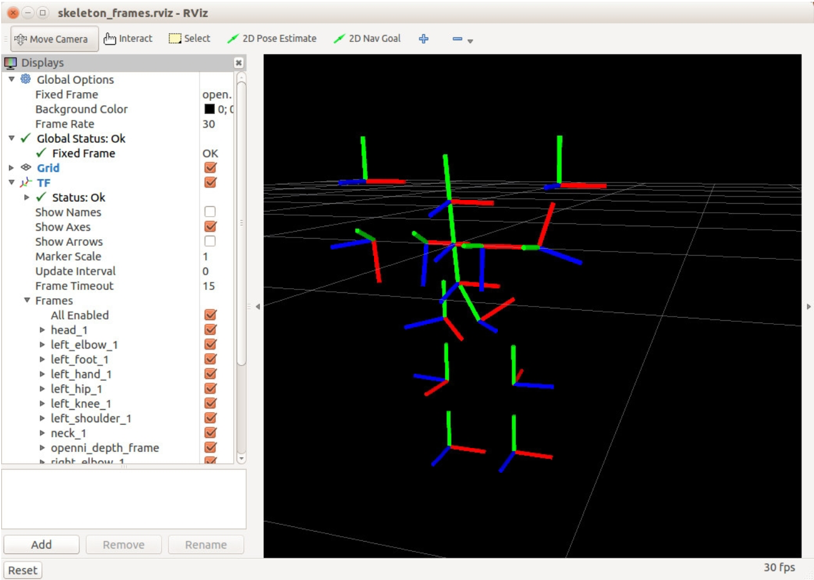
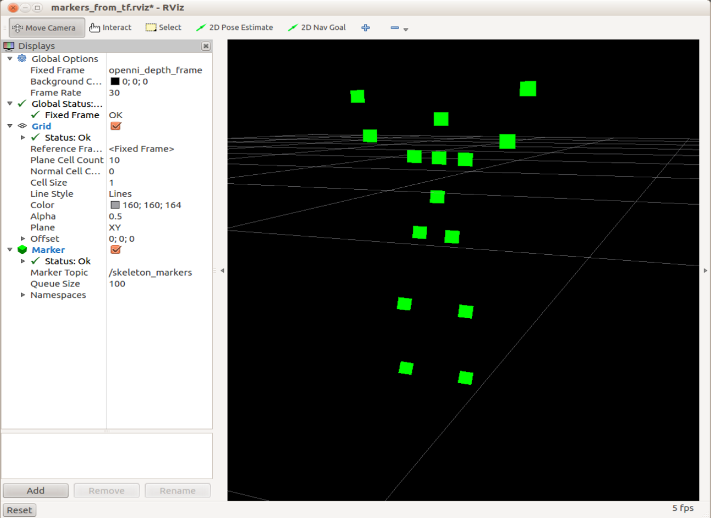

# 10.9 OpenNI и отслеживание скелета

Возможно, самым ранним и самым известным робототехническим приложением, использующим глубинную камеру, является отслеживание скелета. Пакет ROS [openni\_tracker](http://ros.org/wiki/openni_tracker) может использовать данные глубины из Kinect или Asus Xtion для отслеживания положения суставов человека, стоящего перед камерой. Используя эти данные, можно запрограммировать робота на выполнение жестовых команд, сигнализируемых пользователем. Один пример того, как сделать это с помощью ROS и Python, можно найти в пакете [pi\_tracker](http://wiki.ros.org/pi_tracker).

Хотя мы не будем вдаваться в подробности использования отслеживания скелета, давайте хотя бы взглянем на основы.

#### 10.9.1 Установка NITEandopenni\_trackerforROSIndigo

На момент написания этой статьи ни двоичные файлы NITE, ни ROS-пакет openni\_tracker не были доступны в качестве Debian-пакета для ROS Indigo, поэтому их нужно устанавливать вручную.

Чтобы установить двоичные файлы NITE, следуйте этим инструкциям:

1. Загрузите двоичный пакет NiTE v1.5.2.23 по одной из следующих ссылок в зависимости от того, используете ли вы 32-битную или 64-битную установку Ubuntu:

   а. 32-разрядная версия: [http://www.openni.ru/wp-content/uploads/2013/10/NITE-Bin-Linux-](http://www.openni.ru/wp-content/uploads/2013/10/NITE-Bin-Linux-) x86-v1.5.2.23.tar.zip

   б. 64-разрядная версия: [http://www.openni.ru/wp-content/uploads/2013/10/NITE-Bin-Linux-](http://www.openni.ru/wp-content/uploads/2013/10/NITE-Bin-Linux-) x64-v1.5.2.23.tar.zip

2. Разархивируйте и распакуйте архив в любое место по вашему выбору \(например, ~ / tmp\)
3. Распакованный архив - фактически другой архив в формате bz2, поэтому распакуйте и

   распакуйте архив в то же место, что и в шаге 2.

4. Полученная папка должна называться NITE-Bin-Dev-Linux-x64-v1.5.2.23 \(64-разрядная версия\) или NITE-Bin-Linux-x86-v1.5.2.23 \(32-разрядная версия\). Переместитесь в эту папку и затем запустите runtheuninstall.shscript, следуя theinstall.shscripts. Для 64-битной версии это будет выглядеть следующим образом:

```text
$ cd ~/tmp/NITE-Bin-Dev-Linux-x64-v1.5.2.23 
$ sudo ./uninstall.sh
$ sudo ./install.sh
```

5 . Чтобы завершить установку NITE, выполните команду:

```text
$ sudo niLicense -l 0KOIk2JeIBYClPWVnMoRKn5cdY4=
```

Это должно сделать это. Теперь мы готовы установить пакет openni\_tracker как следующим образом:

```text
$ cd ~/catkin_ws/src
$ git clone https://github.com/ros-drivers/openni_tracker.git 
$ cd ~/catkin_ws
$ catkin_make
$ rospack profile
```

#### _10.9.2 Просмотр скелетов в RViz_

Пакет ROS [openni\_tracker](http://ros.org/wiki/openni_tracker) подключается к устройству PrimeSense, такому как Kinect или Asus Xtion, и передает преобразование кадра ROS для каждого скелета, обнаруженного перед камерой. Tf-преобразования определяются относительно openni\_depth\_frame, который встроен в камеру за датчиком глубины.

Чтобы просмотреть каркасные рамки в RViz, выполните следующие действия. Во-первых, подключите камеру Kinect или Asus, а в случае с Kinect убедитесь, что она также имеет питание. Обязательно прекратите запуск любых файлов openni, которые у вас уже есть. Затем выполните команду openni\_tracker:

```text
$ rosrun openni_tracker openni_tracker
```

\(Не беспокойтесь, если вы не видите начального вывода этой команды. Сообщения о состоянии появятся позже, когда вы будете стоять перед камерой и ваши суставы отслеживаются.\)

Теперь вызовите RViz с помощью включенного конфигурационного файла skeleton\_frames.rviz:

```text
$ rosrun rviz rviz -d `rospack find rbx1_vision`/skeleton_frames.rviz
```

Следите за RViz и отойдите от камеры как минимум на 5 или 6 футов, принимая «Пси-позу». \(См. Страницу [openni\_tracker](http://ros.org/wiki/openni_tracker) для примера позы Psi.\) Как только трекер зафиксируется на вас, вы должны увидеть, что ваши скелетные кадры TF появляются в RViz, как показано ниже.



В этот момент вы можете передвигаться как угодно перед камерой, и скелет в RViz должен имитировать ваши действия.

#### _10.9.3 Доступ к каркасным фреймам в ваших программах_

Поскольку узел openni\_tracker делает скелетные соединения доступными в виде кадров ROS, мы можем использовать tf TransformListener, чтобы найти текущую позицию данного соединения. Пример того, как это работает, можно найти в пакете [skeleton\_markers](http://wiki.ros.org/skeleton_markers). Вы можете установить его в свой личный каталог ROS catkin, используя следующие команды:

```text
$ cd ~/catkin_ws/src
$ git clone -b https://github.com/pirobot/skeleton_markers.git 
$ cd skeleton_markers
$ git checkout indigo-devel
$ cd ~/catkin_ws
$ catkin_make
$ rospack profile
```

Давайте попробуем это, прежде чем смотреть на код. Сначала прекратите любые случаи openni\_tracke и RVizyou, возможно, запустили в предыдущем разделе. Затем выполните следующие две команды:

```text
$ roslaunch skeleton_markers markers_from_tf.launch
$ rosrun rviz rviz -d `rospack find \ skeleton_markers`/markers_from_tf.rviz
```

Теперь примите «Psi Pose» перед камерой, следя за RViz, пока калибровка не будет завершена и не начнется отслеживание. Как только трекер закрепится на вас, вы должны увидеть зеленые маркеры скелета в RViz. В этот момент вы можете передвигаться как угодно перед камерой, а скелет в RViz должен следовать вашим действиям, как показано на рисунке ниже:



Прежде чем мы рассмотрим код, давайте удостоверимся, что понимаем файл запуска markers\_from\_tf.launch, указанный ниже:

```text
<launch>
<node pkg="openni_tracker" name="openni_tracker" type="openni_tracker"
output="screen">
<param name="fixed_frame" value="openni_depth_frame" />
</node>
<node pkg="skeleton_markers" name="markers_from_tf" type="markers_from_tf.py" output="screen">
<rosparam file="$(find skeleton_markers)/params/marker_params.yaml" command="load" />
  </node>
</launch>
```

Сначала мы запускаем узел openni\_tracker с фиксированным кадром, установленным на глубину кадра камеры. \(Это по умолчанию, так что строго говоря, указывать параметр в файле запуска не обязательно.\) Затем мы запускаем наш скрипт markers\_from\_tf.py и загружаем параметрfilemarker\_params.yamlfromtheparamsdirectory. Этот файл определяет параметры, описывающие внешний вид маркеров, а также список каркасных фреймов, которые мы хотим отслеживать.

Давайте теперь посмотрим на скрипт markers\_from\_tf.py. Наша общая стратегия будет заключаться в использовании библиотеки tf для нахождения преобразования между каждым каркасным кадром и кадром с фиксированной глубиной. Все, что нам нужно для наших целей - это координаты начала каждого кадра относительно кадра глубины. Это позволяет нам разместить маркер визуализации в этом месте, чтобы представить положение соответствующего скелетного сустава в пространстве.

Ссылка на источник: [markers\_from\_tf.py](https://github.com/pirobot/skeleton_markers/blob/indigo-devel/nodes/markers_from_tf.py)

```text
1 #!/usr/bin/env python 
3 import rospy
5 from visualization_msgs.msg import Marker
6 from geometry_msgs.msg import Point
7 import tf
9 class SkeletonMarkers():
10 def __init__(self):
11 rospy.init_node('markers_from_tf')
13 rospy.loginfo("Initializing Skeleton Markers Node...") 
15 rate = rospy.get_param('~rate', 20)
16 r = rospy.Rate(rate)
18 # There is usually no need to change the fixed frame from the default
19 self.fixed_frame = rospy.get_param('~fixed_frame',
'openni_depth_frame') 
21 # Get the list of skeleton frames we want to track
22 self.skeleton_frames = rospy.get_param('~skeleton_frames', '')
24 # Initialize the tf listener
25 tf_listener = tf.TransformListener()
27 # Define a marker publisher
28 marker_pub = rospy.Publisher('skeleton_markers', Marker, queue_size=5)
30 # Intialize the markers
31 self.initialize_markers()
33 # Make sure we see the openni_depth_frame
34 tf_listener.waitForTransform(self.fixed_frame, self.fixed_frame,
rospy.Time(), rospy.Duration(60.0)) 35
36 # A flag to track when we have detected a skeleton
37 skeleton_detected = False
39 # Begin the main loop
40 while not rospy.is_shutdown():
41 # Set the markers header
42 self.markers.header.stamp = rospy.Time.now()
44 # Clear the markers point list
45 self.markers.points = list()
47 # Check to see if a skeleton is detected
48 while not skeleton_detected:
49 # Assume we can at least see the head frame
50 frames = [f for f in tf_listener.getFrameStrings() if
f.startswith('head_')] 51
52 try:
53 # If the head frame is visible, pluck off the
54 # user index from the name
55 head_frame = frames[0]
56 user_index = head_frame.replace('head_', '')
58 # Make sure we have a transform between the head
59 # and the fixed frame
60 try:
tf_listener.lookupTransform(self.fixed_frame, head_frame, rospy.Time(0))
64 tf.LookupException): 65
(trans, rot) =
skeleton_detected = True
except (tf.Exception, tf.ConnectivityException,
skeleton_detected = False
rospy.loginfo("User index: " + str(user_index)) r.sleep()
except:
skeleton_detected = False
# Loop through the skeleton frames
for frame in self.skeleton_frames:
# Append the user_index to the frame name
skel_frame = frame + "_" + str(user_index) 75
76 # We only need the origin of each skeleton frame
77 # relative to the fixed frame
78 position = Point()
80 # Get the transformation from the fixed frame
81 # to the skeleton frame
82 try:
tf_listener.lookupTransform(self.fixed_frame, skel_frame, rospy.Time(0))
84 position.x = trans[0]
85 position.y = trans[1]
86 position.z = trans[2]
88 # Set a marker at the origin of this frame
89 self.markers.points.append(position)
90 except:
91 pass
93 # Publish the set of markers
94 marker_pub.publish(self.markers)
96 r.sleep() 97
98 def initialize_markers(self):
99 # Set various parameters
100 scale = rospy.get_param('~scale', 0.07)
101 lifetime = rospy.get_param('~lifetime', 0) # 0 is forever
102 ns = rospy.get_param('~ns', 'skeleton_markers')
103 id = rospy.get_param('~id', 0)
104 color = rospy.get_param('~color', {'r': 0.0, 'g': 1.0, 'b': 0.0, 'a':
1.0}) 105
106 # Initialize the marker points list
107 self.markers = Marker()
108 self.markers.header.frame_id = self.fixed_frame
109 self.markers.ns = ns
110 self.markers.id = id
111 self.markers.type = Marker.POINTS
112 self.markers.action = Marker.ADD
113 self.markers.lifetime = rospy.Duration(lifetime)
114 self.markers.scale.x = scale
115 self.markers.scale.y = scale
116 self.markers.color.r = color['r']
117 self.markers.color.g = color['g']
118 self.markers.color.b = color['b']
119 self.markers.color.a = color['a']
120
121if __name__ == '__main__':
122 123 124 125 126
try:
    SkeletonMarkers()
except rospy.ROSInterruptException: pass
```

Давайте рассмотрим ключевые строки:

```text
# There is usually no need to change the fixed frame from the default
19 self.fixed_frame = rospy.get_param('~fixed_frame',
'openni_depth_frame') 20
21 # Get the list of skeleton frames we want to track
22 self.skeleton_frames = rospy.get_param('~skeleton_frames', '')
```

Здесь мы устанавливаем фиксированный кадр по умолчанию, используемый узлом openni\_tracker. Мы также читаем в списке каркасных фреймов, которые мы хотим отслеживать, как указано в файле параметров marker\_params.yaml. Файл параметров выглядит следующим образом:

```text
# The fixed reference frame
fixed_frame: 'openni_depth_frame'
# Update rate
rate: 20
# Height and width of markers in meters scale: 0.07
# Duration of markers in RViz; 0 is forever
lifetime: 0
# Marker namespace
ns: 'skeleton_markers'
# Marker id
id: 0
# Marker color
color: { 'r': 0.0, 'g': 1.0, 'b': 0.0, 'a': 1.0 }
skeleton_frames: [
head,
neck,
torso,
left_shoulder,
left_elbow,
left_hand,
left_hip,
left_knee,
left_foot,
right_shoulder,
right_elbow,
right_hand,
right_hip,
right_knee,
right_foot
]
```

Файл параметров используется для определения частоты обновления, появления маркеров для отображения в RViz и списка кадров скелета, которые мы хотим отслеживать.

Возвращаясь к сценарию markers\_from\_tf.py:

```text
# Initialize the tf listener
25 tf_listener = tf.TransformListener()
27 # Define a marker publisher
28 marker_pub = rospy.Publisher('skeleton_markers', Marker, queue_size=5)
```

Здесь мы создаем TransformListener из библиотеки ROS tf и настраиваем издателя для маркеров визуализации.

```text
self.initialize_markers()
```

Эта строка вызывает функцию \(определенную позже в скрипте\) для инициализации маркеров. Мы не будем обсуждать маркеры в этом томе, но вы, вероятно, можете довольно легко следовать функции инициализации. Вы также можете посмотреть [Учебное пособие](http://ros.org/wiki/rviz/Tutorials/Markers:%20Basic%20Shapes) по маркерам в ROS Wiki, хотя примеры приведены на C ++.

```text
tf_listener.waitForTransform(self.fixed_frame, self.fixed_frame, rospy.Time(), rospy.Duration(60.0))
```

Прежде чем мы начнем искать каркасные кадры, мы должны убедиться, что, по крайней мере, видим фиксированный кадр камеры, и у нас есть 60 секунд до истечения времени ожидания.

```text
skeleton_detected = False
```

Флаг, указывающий, виден ли скелет.

```text
# Begin the main loop
while not rospy.is_shutdown():
# Set the markers header self.markers.header.stamp = rospy.Time.now()
    # Clear the markers point list
self.markers.points = list()
```

Теперь мы входим в основной цикл скрипта. Сначала мы отметим время в списке маркеров и очистим все координаты маркера.

```text
f.startswith('head_')]
while not skeleton_detected:
# Assume we can at least see the head frame
frames = [f for f in tf_listener.getFrameStrings() if
```

Затем мы используем слушатель tf, чтобы получить список всех доступных кадров и проверить, можем ли мы видеть головной кадр.

```text
try:
# If the head frame is visible, pluck off the # user index from the name
head_frame = frames[0]
user_index = head_frame.replace('head_', '') 
# Make sure we have a transform between the head
# and the fixed frame
try:
tf_listener.lookupTransform(self.fixed_frame, head_frame, rospy.Time(0))
tf.LookupException): 
skeleton_detected = True
except (tf.Exception, tf.ConnectivityException,
skeleton_detected = False
rospy.loginfo("User index: " + str(user_index)) r.sleep()
except:
skeleton_detected = False
```

Если у нас есть рамка заголовка, внешний блок try-Кроме будет успешным, и мы ищем преобразование между рамкой головы и фиксированной рамкой. Если поиск успешен, мы можем быть уверены, что обнаружили скелет, и мы установили флаг в True, чтобы мы могли выйти из внешнего цикла while.

```text
for frame in self.skeleton_frames:
# Append the user_index to the frame name
skel_frame = frame + "_" + str(user_index)
# We only need the origin of each skeleton frame
# relative to the fixed frame
position = Point()
# Get the transformation from the fixed frame
# to the skeleton frame
try:
tf_listener.lookupTransform(self.fixed_frame, skel_frame, rospy.Time(0))
position.x = trans[0]
position.y = trans[1]
position.z = trans[2]
# Set a marker at the origin of this frame
self.markers.points.append(position)
except:
pass
```

Теперь мы можем перебрать все каркасные кадры и попытаться найти преобразование между каждым кадром и фиксированным кадром. Если поиск выполнен успешно, перевод и ротация возвращаются отдельно. Мы заботимся только о компоненте перевода \(расположении источника кадра относительно фиксированного кадра\), поэтому мы храним компоненты x, y и z в переменной позиции, которую мы инициализировали ранее как тип Point. Этот пункт затем добавляется в список маркеров.

```text
marker_pub.publish(self.markers)
r.sleep()
```

Как только у нас есть маркер для каждого кадра, мы публикуем весь набор маркеров, а затем подождите один цикл, прежде чем начинать новый цикл.

