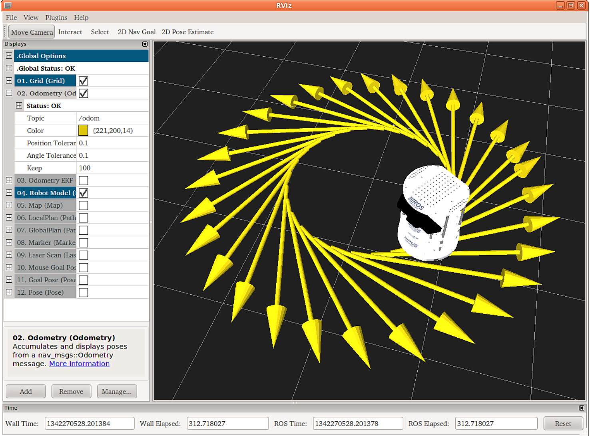

# 2.1 Gazebo, этапы и симулятор ArbotiX

Существует несколько способов имитации робота в ROS. Самый сложный использует [Gazebo](http://gazebosim.org/), полнофункциональный 3-D физический симулятор, который предшествовал ROS, но теперь прекрасно интегрируется с ним. На втором [этапе ](http://wiki.ros.org/stage)используется более простой 2-D симулятор, который может управлять несколькими роботами и различными датчиками, такими как лазерные сканеры. Третий использует пакет [Arbotix\_python](http://ros.org/wiki/arbotix_python) Майкла Фергюсона, который может запустить поддельную симуляцию робота с дифференциальным приводом, но без обратной связи с датчиком или какой-либо физики. Мы будем использовать этот последний метод, поскольку он является самым простым в настройке, и нам не нужна физика для наших целей. Конечно, не стесняйтесь исследовать беседку и сцену, но будьте готовы потратить немного времени на проработку деталей. Кроме того, Gazebo, в частности, требует довольно большой мощности процессора. 

Даже если у вас есть свой собственный робот, неплохо сначала запустить некоторые примеры из этой книги в симуляторе. Как только вы будете довольны результатами, вы можете попробовать его на своем роботе.

