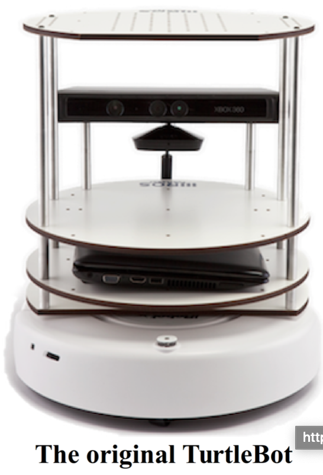

# 2.2 Знакомство с роботами TurtleBot, Maxwell и Pi Robot

Для целей этой книги нам нужен робот, который мы можем, по крайней мере, запустить в симуляторе, чтобы проверить наш код. Репозиторий ros-by-example включает поддержку двух тестовых роботов, The [Willow Garage TurtleBot](http://wiki.ros.org/action/show/Robots/TurtleBot?action=show&redirect=TurtleBot), созданный [Melonee Wise ](http://www.meloneewise.com/?page_id=31)и [Tully Foote](http://www.osrfoundation.org/team/tully-foote/) и собственный самодельный робот автора под названием [Pi Robot](http://www.pirobot.org/). 

Pi был вдохновлен [Michael Ferguson's Maxwell](http://www.showusyoursensors.com/), который, в свою очередь, был смоделирован по образцу робота [El-E](http://www.ros.org/news/2010/03/robots-using-ros-georgia-techs-assistive-robots.html) компании Georgia Tech. Если у вас есть модель URDF вашего собственного робота, вы можете использовать его вместо одного из них. В любом случае, большая часть кода, который мы разрабатываем, будет работать практически на любом роботе, поддерживающем основные интерфейсы сообщений ROS.

