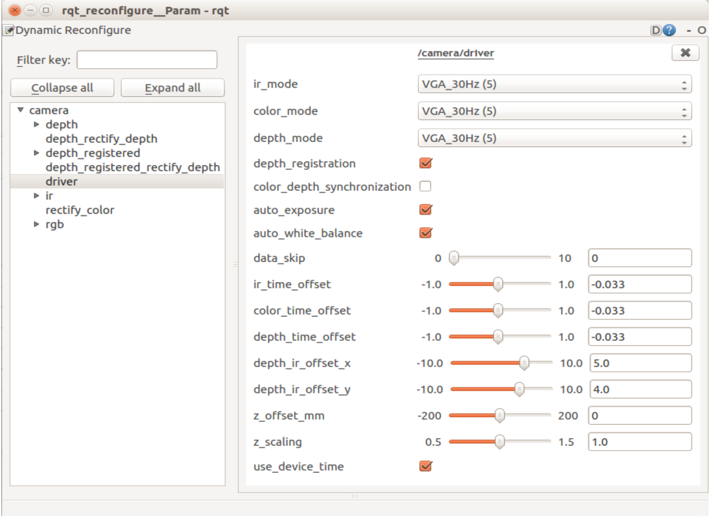

# 4.11 Использование rqt\_reconfigure для установки параметров ROS

Возможность настройки параметров ROS на лету часто бывает полезна для настройки или отладки запущенного приложения. Как вы помните из учебника [по сервисам и параметрам](http://wiki.ros.org/ROS/Tutorials/UnderstandingServicesParams%23Using_rosparam), ROS предоставляет инструмент командной строки rosparam для получения и настройки параметров. Однако внесенные таким образом изменения параметров не будут считываться узлом до тех пор, пока он не будет перезапущен. 

Пакет ROS [rqt\_reconfigure](http://wiki.ros.org/rqt_reconfigure) \(ранее называемый dynamic\_reconfigure\)предоставляет простой в использовании графический интерфейс для подмножества параметров на сервере параметров. Он может быть запущен в любое время с помощью команды:

```text
$ rosrun rqt_reconfigure rqt_reconfigure
```

На рисунке ниже показано, как будет выглядеть графический интерфейс при настройке openni2 узел камеры при подключении к камере Xtion Pro:



Графический интерфейс rqt\_reconfigure позволяет динамически изменять параметры узлов, т. е. без необходимости перезапуска узла. Однако есть одна загвоздка: в графическом интерфейсе rqt\_reconfigure будут видны только узлы, запрограммированные с помощью API rqt\_reconfigure. Это включает в себя большинство узлов в ключевых стеках ROS и пакетах, таких как навигация, но многие сторонние узлы не используют API и поэтому могут быть изменены только с помощью инструмента командной строки rosparam с последующим перезапуском узла. 

**Примечание**: В отличие от пакета dynamic\_reconfigure в предыдущих версиях ROS, rqt\_reconfigure не появляется для динамического обнаружения новых узлов, если они запускаются после запуска графического интерфейса. Чтобы увидеть только что запущенный узел в графическом интерфейсе rqt\_reconfigure, закройте графический интерфейс и снова верните его обратно. 

Добавление поддержки rqt\_reconfigure к вашим собственным узлам несложно, и если вы хотите узнать, как это сделать, обратитесь к пошаговым учебникам по динамической перенастройке [на Вики-сайте ROS](http://ros.org/wiki/dynamic_reconfigure/Tutorials). \(Да, учебники все еще используют старое название.\) Эта тема также подробно освещена в [Томе 2](http://www.pirobot.org/wordpress/) серии ROS By Example. У нас будет возможность использовать графический интерфейс реконфигурации в нескольких разделах книги. Поэтому было бы неплохо ознакомиться с его поведением, пройдя через введение [rqt\_reconfigure](http://wiki.ros.org/rqt_reconfigure) на Ros Wiki.

