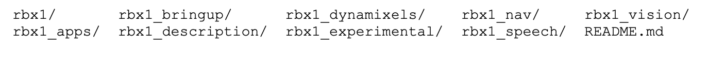

# 5.2.4. Клонирование репозитория rbx1 для Indigo в первый раз

Чтобы впервые клонировать и построить репозиторий rbx1 для Indigo, выполните следующие действия:

```text
$ cd ~/catkin_ws/src
$ git clone https://github.com/pirobot/rbx1.git $ cd rbx1
$ git checkout indigo-devel
$ cd ~/catkin_ws
$ catkin_make
$ source ~/catkin_ws/devel/setup.bash
$ rospack profile
```

**ПРИМЕЧАНИЕ 1.** Четвертая команда выше \(git checkout indigo-devel\) имеет решающее значение - здесь вы выбираете ветку Indigo хранилища. \(По умолчанию операция клонирования проверяет ветку Groovy для тех, кто все еще использует Groovy.\) 

**ПРИМЕЧАНИЕ 2.** Исходную команду, указанную выше, следует добавить в конец файла ~ / .bashrc, если вы этого еще не сделали. Это обеспечит добавление ваших пакетов catkin в ваш ROS\_PACKAGE\_PATH при каждом открытии нового терминала.

 Если код ROS By Example будет обновлен позднее, вы можете объединить обновления с локальной копией репозитория с помощью следующих команд:

```text
$ cd ~/catkin_ws/src/rbx1 $ git pull
$ cd ~/catkin_ws
$ catkin_make
$ source ~/catkin_ws/devel/setup.bash
```

**Будьте в курсе**: если вы хотите получать уведомления об обновлениях как книги, так и сопровождающего кода, присоединяйтесь к группе Google на основе ros-example.

 Все пакеты ROS By Example начинаются с букв rbx1. Чтобы вывести список пакетов, перейдите в родительский метапакет rbx1 и используйте команду Linux ls:

```text
$ roscd rbx1 
$ cd ..
$ ls -F
```

что должно привести к следующему листингу:



```text
rbx1/        rbx1_bringup/     rbx1_dynamixels/    rbx1_nav/    rbx1_vision/
rbx1_apps/   rbx1_description/ rbx1_experimental/  rbx1_speech/ README.md
```

На протяжении всей книги мы будем использовать команду roscd для перехода от одного пакета к другому. Например, чтобы перейти в пакет rbx1\_speech, вы должны использовать команду:

```text
$ roscd rbx1_speech
```

Обратите внимание, что вы можете запустить эту команду из любого каталога, и ROS найдет пакет.

 **ВАЖНО!** Если вы используете два компьютера для управления или мониторинга своего робота, например ноутбук на роботе и второй компьютер на рабочем столе, обязательно клонируйте и создайте ветку Indigo репозитория rbx1 на обеих машинах.

