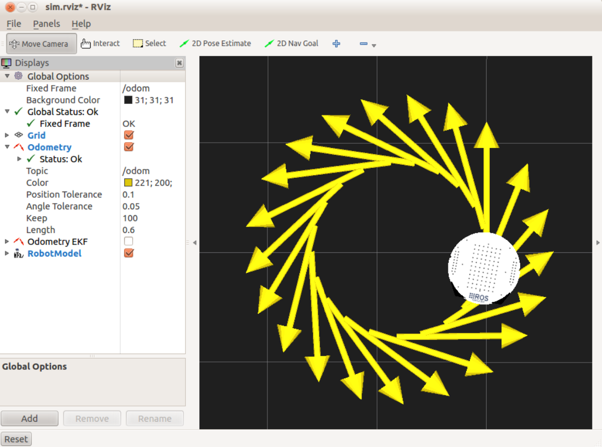

# 6.2 Тестирование симулятора

Чтобы убедиться, что все работает, убедитесь, что roscore работает, затем запустите смоделированный TurtleBot следующим образом:

```text
$ roslaunch rbx1_bringup fake_turtlebot.launch
```

что должно привести к следующим сообщениям при запуске:

> process\[arbotix-1\]: started with pid \[4896\] process\[robot\_state\_publisher-2\]: started with pid \[4897\] \[INFO\] \[WallTime: 1338681385.068539\] ArbotiX being simulated. \[INFO\] \[WallTime: 1338681385.111492\] Started DiffController \(base\_controller\). Geometry: 0.26m wide, 4100.0 ticks/m.

Чтобы вместо этого использовать модель Pi Robot, выполните команду:

```text
$ roslaunch rbx1_bringup fake_pi_robot.launch
```

Далее, запустите RViz, чтобы мы могли наблюдать за симулированным роботом в действии:

```text
$ rosrun rviz rviz -d `rospack find rbx1_nav`/sim.rviz
```

\(Обратите внимание, как мы используем оператор backtick в Linux вместе с командой rospack find, чтобы найти пакет rbx1\_nav без необходимости вводить полный путь.\) 

Если все прошло правильно, вы должны увидеть TurtleBot \(или Pi Robot\) в RViz. \(Вид по умолчанию сверху вниз. Чтобы изменить вид, нажмите на меню «Панели» в RViz и выберите пункт меню «Виды».\) 

Чтобы проверить симуляцию, откройте другое окно терминала или вкладку и выполните следующую команду, которая должна заставить симулированного робота двигаться по кругу против часовой стрелки:

```text
$ rostopic pub -r 10 /cmd_vel geometry_msgs/Twist '{linear: {x: 0.2, y: 0, z: 0}, angular: {x: 0, y: 0, z: 0.5}}'
```

Вид в RViz должен выглядеть примерно так. \(Изображение ниже было увеличено с помощью колеса прокрутки мыши.\)



Чтобы остановить вращение, введите Ctrl-C в том же окне терминала, а затем опубликуйте пустое сообщение Twist:

```text
$ rostopic pub -1 /cmd_vel geometry_msgs/Twist '{}'
```

