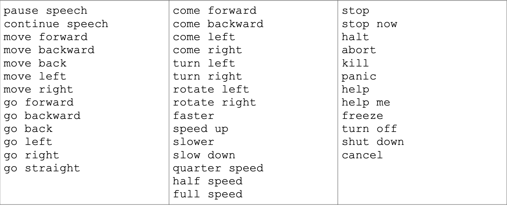

# 9. РАСПОЗНАВАНИЕ И СИНТЕЗ РЕЧИ

За последние несколько лет распознавание речи и Linux прошли долгий путь, главным образом благодаря проектам [CMU Sphinx](http://cmusphinx.sourceforge.net/) и [Festival](http://festvox.org/). Мы также можем воспользоваться существующими пакетами ROS для распознавания речи и преобразования текста в речь. Следовательно, довольно просто добавить речевой контроль и голосовую обратную связь к вашему роботу, как мы сейчас покажем.

В этой главе мы будем:

* Установите тестовый [pocketsphinx](http://wiki.ros.org/pocketsphinx) пакет для распознавания речи 
* Узнайте, как создать свой собственный словарный запас для распознавания речи  
* Телеоператорская зона имитации робота с использованием голосовых команд 
*  Установите тестовый набор текста в речь и пакет ROS [sound\_play](http://wiki.ros.org/pocketsphinx)

#### _9.1 Установка PocketSphinx для распознавания речи_

Благодаря Майклу Фергюсону мы можем использовать пакет ROS [pocketsphinx](http://wiki.ros.org/pocketsphinx) для распознавания речи. Пакет pocketsphinx требует установки пакета Ubuntu gstreamer0.10-pocketsphinx, и нам также потребуется стек звуковых драйверов ROS \(на случай, если у вас его еще нет\), поэтому давайте сначала позаботимся об обоих. Вам будет предложено установить пакеты Festival, если у вас их еще нет - ответьте «Y», если будет предложено:

```text
$ sudo apt-get install gstreamer0.10-pocketsphinx 
$ sudo apt-get install ros-indigo-pocketsphinx
$ sudo apt-get install ros-indigo-audio-common
$ sudo apt-get install libasound2
```

В пакет pocketsphinx входит узелognizer.py. Этот скрипт выполняет всю тяжелую работу по подключению к аудиовходу вашего компьютера и сопоставлению голосовых команд со словами или фразами в текущем словаре. Когда узел распознавателя соответствует слову или фразе, он публикует его в теме /ognizer / output. Другие узлы могут подписаться на эту тему, чтобы узнать, что только что сказал пользователь.

#### _9.2. Тестирование распознавателя PocketSphinx_

Вы получите наилучшие результаты распознавания речи при использовании микрофона гарнитуры, USB, стандартного аудио или Bluetooth. Подключив микрофон к компьютеру, убедитесь, что он выбран в качестве входного аудиоустройства. \(Если вы используете Ubuntu 14.04 или более поздней версии, перейдите в «Системные настройки» и нажмите на панели управления звуком.\) Когда откроется окно «Настройки звука», щелкните вкладку «Вход» и выберите свое микрофонное устройство из списка \(если их несколько\). \). Произнесите несколько слов в микрофон, и вы увидите, как реагирует измеритель громкости. Затем нажмите на вкладку «Вывод», выберите желаемое устройство вывода и отрегулируйте ползунок громкости. Наконец, закройте окно звука.

**ПРИМЕЧАНИЕ**. Если вы отсоедините микрофон USB или Bluetooth, а затем снова подключите его, вам, вероятно, придется снова выбрать его в качестве входа, используя процедуру, описанную выше.

Майкл Фергюсон включает файл словаря, подходящий для соревнований RoboCup @ Home, который вы можете использовать для тестирования распознавателя. Запустите его сейчас, запустив:

```text
$ roslaunch pocketsphinx robocup.launch
```

Вы должны увидеть список сообщений INFO, указывающих, что загружаются различные части модели распознавания. Последние несколько сообщений будут выглядеть примерно так:

> INFO: ngram\_search\_fwdtree.c\(186\): Creating search tree  
>  INFO: ngram\_search\_fwdtree.c\(191\): before: 0 root, 0 non-root channels, 12 single-phone words  
>  INFO: ngram\_search\_fwdtree.c\(326\): after: max nonroot chan increased to 328  
>  INFO: ngram\_search\_fwdtree.c\(338\): after: 77 root, 200 non-root channels, 11 single-phone words

Теперь произнесите несколько фраз RoboCup, таких как «принеси мне стакан», «иди на кухню» или «пойдем со мной». В окне терминала вы должны увидеть строки INFO, которые повторяют произносимые фразы:

> \[INFO\] \[WallTime: 1387548761.587537\] bring me the glass \[INFO\] \[WallTime: 1387548765.296757\] go to the kitchen \[INFO\] \[WallTime: 1387548769.417876\] come with me

Поздравляем, теперь вы можете поговорить со своим роботом! Распознанная фраза также публикуется в теме /recognizer/output. Чтобы увидеть результат, вызовите другой терминал и запустите:

```text
$ rostopic echo /recognizer/output
```

Чтобы увидеть все фразы, которые вы можете использовать с демонстрацией RoboCup, выполните следующие команды:

> data: bring me the glass   
> ---  
>  data: go to the kitchen  
>  ---  
> data: come with me ---

Для моего голоса и использования встроенного микрофона Bluetooth распознаватель оказался на удивление быстрым и точным.

Чтобы увидеть все фразы, которые вы можете использовать с демонстрацией RoboCup, выполните следующие команды:

```text
$ roscd pocketsphinx/demo 
$ more robocup.corpus
```

Теперь попробуйте произнести фразу, которой нет в словаре, например, «небо голубое». В моем случае результат в теме /ognizer / output был «эта комната пуста». Как видите, распознаватель ответит чем-то, что бы вы ни говорили. Это означает, что необходимо соблюдать осторожность, чтобы «отключить» распознаватель речи, если вы не хотите, чтобы случайный разговор интерпретировался как речевые команды. Ниже мы увидим, как это сделать, когда узнаем, как сопоставить распознавание речи с действиями.

#### _9.3 Создание словарного запаса_

Создать новый словарь или корпус легко, как указано в PocketSphinx. Сначала создайте простой текстовый файл с одним словом или фразой в строке. Вот корпус, который можно использовать для управления роботом с помощью голосовых команд. Мы будем хранить его в файле с именем nav\_commands.txt в подкаталоге config пакета rbx1\_speech. Чтобы просмотреть его содержимое, выполните команды:

```text
$ roscd rbx1_speech/config 
$ more nav_commands.txt
```

Вы должны увидеть следующий список фраз \(они будут отображаться в одном столбце на вашем экране\):



Вы также можете перенести файл в ваш любимый редактор и добавить, удалить или изменить некоторые из этих слов или фраз, прежде чем переходить к следующему шагу. Когда вы вводите свои фразы, старайтесь не смешивать прописные и строчные буквы и не используйте знаки препинания. Кроме того, если хотите включить число, например 54, обозначьте его как «пятьдесят четыре».

Прежде чем мы сможем использовать этот корпус с PocketSphinx, нам нужно скомпилировать его в специальный словарь и файлы произношения. Это можно сделать с помощью онлайн-модели языковой модели CMU \(**lm**\), расположенной по адресу:

[http://www.speech.cs.cmu.edu/tools/lmtool-new.html](http://www.speech.cs.cmu.edu/tools/lmtool-new.html)

Следуйте инструкциям по загрузке файла nav\_commands.txt, нажмите кнопку **«Compile Knowledge Base»**, затем загрузите файл с пометкой **«COMPRESSED TARBALL»**, содержащий все файлы языковой модели. Извлеките эти файлы в подкаталог config из пакета rbx1\_speech. Все файлы будут начинаться с одного и того же номера, например 3026.dic, 3026.lm и т. Д. Эти файлы определяют ваш словарный запас как языковую модель, понятную PocketSphinx. Вы можете переименовать все эти файлы во что-нибудь более запоминающееся, используя команду, подобную следующей \(4-значный номер, вероятно, будет другим в вашем случае\):

```text
$ roscd rbx1_speech/config
$ rename -f 's/3026/nav_commands/' *
```

Далее, посмотрите на файл voice\_nav\_commands.launch, находящийся в подкаталоге rbx1\_speech / launch. Это выглядит так:

> &lt;launch&gt;  
>  &lt;node name="recognizer" pkg="pocketsphinx" type="recognizer.py"
>
> output="screen"&gt;  
>  &lt;param name="lm" value="$\(find rbx1\_speech\)/config/nav\_commands.lm"/&gt;

> &lt;param name="dict" value="$\(find rbx1\_speech\)/config/nav\_commands.dic"/&gt; &lt;/node&gt;
>
> &lt;/launch&gt;

Как вы можете видеть, файл запуска запускает узелognizer.py из пакета pocketsphinx, и мы указываем параметры lm и dict на файлы nav\_commands.lmandnav\_commands.diccreatedinthestepsabove. Также обратите внимание, что параметр output = "screen" - это то, что позволяет нам видеть результаты распознавания в реальном времени в окне запуска.

Запустите этот файл и проверьте распознавание речи, контролируя тему /ognizer / output. Сначала нажмите Ctrl-C, чтобы завершить предыдущую демонстрацию RoboCup, если она все еще работает. Затем запустите команды:

```text
$ roslaunch rbx1_speech voice_nav_commands.launch
```

И в другом терминале:

```text
$ rostopic echo /recognizer/output
```

Попробуйте произнести несколько навигационных фраз, таких как «двигаться вперед», «замедлить» и «остановить». Вы должны увидеть, что ваши команды отражены в теме /ognizer / output.


