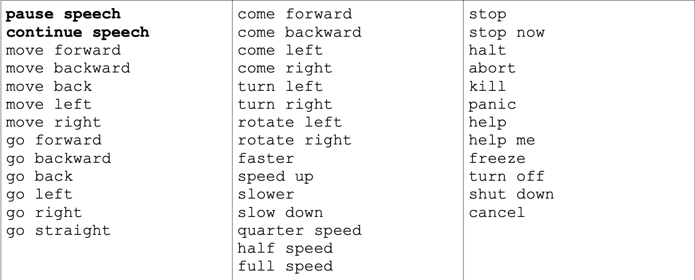

# 9.4.1. Тестирование голосового управления в симуляторе ArbotiX

Прежде чем использовать голосовую навигацию с реальным роботом, давайте попробуем в симуляторе ArbotiX. Сначала запустите поддельный TurtleBot, как мы делали раньше:

```text
$ roslaunch rbx1_bringup fake_turtlebot.launch
```

Далее, запустите RViz с файлом конфигурации симуляции:

```text
$ rosrun rviz rviz -d `rospack find rbx1_nav`/sim.rviz
```

Давайте также используем rqt\_console для более удобного мониторинга вывода скрипта голосовой навигации. В частности, это позволит нам просматривать команды, которые распознает скрипт:

```text
$ rqt_console &
```

Затем проверьте настройки звука, как описано ранее, чтобы убедиться, что ваш микрофон все еще установлен в качестве устройства ввода. Теперь запустите файл voice\_nav\_commands.launch, который вызывает распознаватель PocketSphinx со словарем навигации:

```text
$ roslaunch rbx1_speech voice_nav_commands.launch
```

Наконец, используйте файл turtlebot\_voice\_nav.launch для запуска узла voice\_nav.py. Этот файл запуска \(находится в каталоге rbx1\_speech / launch\) запускает узел voice\_nav.py при настройке некоторых параметров, управляющих скоростью имитируемого робота:

```text
$ roslaunch rbx1_speech turtlebot_voice_nav.launch
```

Теперь вы сможете использовать голосовые команды для перемещения фальшивого TurtleBot в RViz. Например, попробуйте команды «повернуть влево», «двигаться вперед», «на полной скорости», «остановить» и так далее. Вот список голосовых команд снова для удобства использования:



Вы также можете попробовать две специальные команды, **«приостановить речь»** и **«продолжить речь»**, чтобы посмотреть, сможете ли вы отключить и снова включить голосовое управление.

#### \_\_

