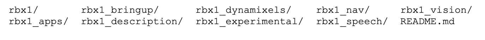

# 5.2 Клонирование репозитория Indigo Ros-by-example

**ВАЖНО**: Если вы установили предыдущие версии репозитория ros-by-example для ROS Electric, Fuerte, Groovy или Hydro, следуйте соответствующим инструкциям ниже, чтобы заменить или переопределить вашу установку версией Indigo. Обратите внимание, что первые три версии кода на примере ros \(Electric, Fuerte и Groovy\) использовали систему rosbuild, тогда как версии Hydro и Indigo используют catkin. Если вы впервые устанавливаете код ros-example, вы можете пропустить первые два раздела и сразу перейти к разделу 5.2.3.

_**5.2.1 Обновление от Electric или Fuerte**_ 

Стек ros-by-example для ROS Electric и Fuerte распространяется в виде хранилища SVN с именем rbx\_vol\_1 в Google Code. Либо удалите этот старый стек из своего каталога ~ / ros\_workspace, либо, если вы внесли изменения, которые вы не хотите потерять, переместите старый каталог rbx\_vol\_1 из вашего ROS\_PACKAGE\_PATH перед установкой нового репозитория. 

_**5.2.2 Обновление с Groovy**_ 

Пакеты ros-by-example для ROS Groovy и Indigo распространяются как Git-репозиторий calledrbx1onGitHub. Thedefaultbranchiscalledgroovy-develandit - это версия rosbuild-репозитория, используемая в Groovy-версии книги. Для ROS Indigo вам нужно использовать ветку indigo-devel репозитория, которая была преобразована в более новую систему сборки catkin. Это означает, что вам также нужно установить код в личном каталоге ~ / catkin\_ws / src, а не в ~ / ros\_workspace. Если вы использовали Groovy-версию кода rbx1, либо удалите старый репозиторий из своего каталога ~ / ros\_workspace, либо, если вы внесли изменения, которые не хотите потерять, удалите старый каталог rbx1 из своего ROS\_PACKAGE\_PATH перед тем, как установка нового репозитория. 

_**5.2.3 Обновление с Hydro**_ 

Пакеты ros-by-example для ROS Hydro и Indigo распространяются в том же репозитории Github, который называется rbx1. Предполагая, что вы уже извлекли ветвь гидроуровня в свою рабочую область catkin, вы можете перейти на ветку индиго-уровня следующим образом. 

Если вы использовали версию Hydro кода rbx1 и внесли изменения в свою локальную копию, вы можете сохранить эти изменения с помощью команды git stash перед проверкой ветви indigo-devel:

```text
$ roscd rbx1
$ cd ..
$ git stash
$ git pull
$ git checkout indigo-devel $ cd ~/catkin_ws
$ catkin_make
```

_**5.2.4. Клонирование репозитория rbx1 для Indigo в первый раз**_ 

Чтобы впервые клонировать и построить репозиторий rbx1 для Indigo, выполните следующие действия:

```text
$ cd ~/catkin_ws/src
$ git clone https://github.com/pirobot/rbx1.git $ cd rbx1
$ git checkout indigo-devel
$ cd ~/catkin_ws
$ catkin_make
$ source ~/catkin_ws/devel/setup.bash
$ rospack profile
```

**ПРИМЕЧАНИЕ 1.** Четвертая команда выше \(git checkout indigo-devel\) имеет решающее значение - здесь вы выбираете ветку Indigo хранилища. \(По умолчанию операция клонирования проверяет ветку Groovy для тех, кто все еще использует Groovy.\) 

**ПРИМЕЧАНИЕ 2.** Исходную команду, указанную выше, следует добавить в конец файла ~ / .bashrc, если вы этого еще не сделали. Это обеспечит добавление ваших пакетов catkin в ваш ROS\_PACKAGE\_PATH при каждом открытии нового терминала.

 Если код ROS By Example будет обновлен позднее, вы можете объединить обновления с локальной копией репозитория с помощью следующих команд:

```text
$ cd ~/catkin_ws/src/rbx1 $ git pull
$ cd ~/catkin_ws
$ catkin_make
$ source ~/catkin_ws/devel/setup.bash
```

**Будьте в курсе**: если вы хотите получать уведомления об обновлениях как книги, так и сопровождающего кода, присоединяйтесь к группе Google на основе ros-example.

 Все пакеты ROS By Example начинаются с букв rbx1. Чтобы вывести список пакетов, перейдите в родительский метапакет rbx1 и используйте команду Linux ls:

```text
$ roscd rbx1 
$ cd ..
$ ls -F
```

что должно привести к следующему листингу:



```text
rbx1/        rbx1_bringup/     rbx1_dynamixels/    rbx1_nav/    rbx1_vision/
rbx1_apps/   rbx1_description/ rbx1_experimental/  rbx1_speech/ README.md
```

На протяжении всей книги мы будем использовать команду roscd для перехода от одного пакета к другому. Например, чтобы перейти в пакет rbx1\_speech, вы должны использовать команду:

```text
$ roscd rbx1_speech
```

Обратите внимание, что вы можете запустить эту команду из любого каталога, и ROS найдет пакет.

 **ВАЖНО!** Если вы используете два компьютера для управления или мониторинга своего робота, например ноутбук на роботе и второй компьютер на рабочем столе, обязательно клонируйте и создайте ветку Indigo репозитория rbx1 на обеих машинах.

